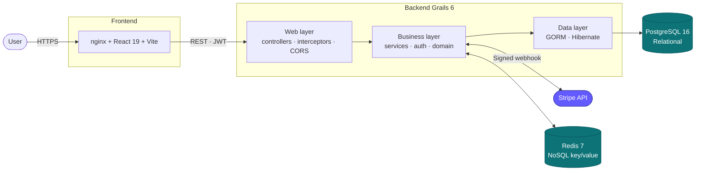

# Architecture

Modular monolithic web application, organised as a **layered, distributed architecture** following the ANSSI recommendations for secure applications.



## Modular monolith vs microservices

!!! tip "Architecture decision"
    Given the project scope and team size (1 developer), a **modular monolith**
    is preferable to microservices. Direct transactional consistency, single
    deployment artefact, zero inter-module latency.

For this scope (shop, permits, contests, catch log, leaderboard, admin) and team (one developer), a **modular monolith** is the right pick:

- **Simple transactional consistency**: an order that decrements stock and marks the payment as paid fits in **a single Postgres transaction**, with no distributed saga and no eventual consistency to design around.
- **Single deployment**: a single Docker artefact → trivial deployment, no service mesh, no inter-service API versioning to maintain.
- **No network between modules**: zero inter-service latency, no retries or circuit breakers to wire up.

The code is still organised by **functional domain** (catalogue, order, payment, permit, contest, catch log) — if one domain ever needs to become a separate service (e.g. PDF invoicing), the extraction stays feasible because the Grails services are already decoupled.

## Storage strategy: SQL + NoSQL

!!! abstract "Guiding principle"
    The choice between SQL and NoSQL is made **based on the nature of the
    data**, not based on hype. We are not replacing Postgres with Redis: they
    coexist, each on its home turf.

| Data | Volume | Required consistency | Target latency | TTL | → Choice |
|---|---|---|---|---|---|
| Products, orders, line items, users, permits, contests, reviews | Low-medium | **Strict ACID** (FK, stock, payment) | < 100 ms | Permanent | **PostgreSQL** |
| Auth rate-limit counters (login, register, pwd-reset) | High (≥ 1 hit / request) | `INCR` atomicity | **< 5 ms** | 60 s — 15 min | **Redis** |
| Stripe event IDs already processed (webhook idempotency) | Low | Not critical (defense in depth) | < 5 ms | 24 h | **Redis** |

### Why PostgreSQL for the business core
- **Integrity constraints**: foreign keys, `NOT NULL`, `CHECK`, uniqueness — the database refuses inconsistent states.
- **ACID transactions**: `OrderService` chains stock decrement + line creation + PaymentIntent persistence into a single transaction. If anything fails, automatic rollback.
- **Joins and aggregates**: `StatsService` computes revenue, average basket, top products across 5 joined tables — a key/value store simply cannot do that.
- **Absolute durability**: losing an order would cost money and customer trust.

### Why Redis (NoSQL) for rate-limiting and idempotency
- **Performance**: `INCR` + `EXPIRE` happen in sub-millisecond time. Doing the same in Postgres would add a join and a lock per auth request.
- **Native TTL**: `EXPIRE key 60` on the Redis side means no table to purge on Postgres, no cron job to maintain.
- **K/V atomicity**: `INCR` is atomic by design → no race condition between concurrent backend instances. `SETNX` (set if not exists) likewise for idempotency.
- **Ephemeral data**: if Redis crashes, we lose rate-limit counters — acceptable (the window restarts). Unacceptable for an order.
- **Sharing across instances**: if the app scales to 2 backend replicas behind nginx, an in-memory local counter lets an attacker **alternate instances to double their quota**. Shared Redis closes that gap.

## Redis use cases implemented

### 1. Shared anti-brute-force rate-limit — `RateLimitService`

!!! danger "Security hole fixed"
    With an **in-memory local** rate-limit, deploying the backend as 2 instances
    behind a load balancer lets an attacker **alternate instances to double their
    quota**. Shared Redis closes that gap by globalising the counter.

**Why**: OWASP Top 10 A07:2021 *Identification and Authentication Failures* recommends **global** counters on auth endpoints. Without that, an attacker can try about 10⁴ login/password pairs per minute.

**Algorithm**: fixed-window counter.

```
INCR rl:<key>              → returns the new counter N
IF N == 1: EXPIRE rl:<key> <windowSec>
allow ⇔ N <= maxRequests
```

| Endpoint | Key | Max | Window |
|---|---|---|---|
| `POST /api/auth/register` | `register:<ip>` | 5 | 1 min |
| `POST /api/auth/login` | `login:<ip>` + `login:<email>` | 5 | 1 min |
| `POST /api/auth/forgot-password` | `pwd-reset:<email>` | 3 | 15 min |

**In-memory fallback**: if Redis is unavailable, the service falls back to a local `ConcurrentHashMap`. Rate-limiting still works but is local to the instance (degraded mode). A warning is logged (throttled to 1/min to avoid spam).

### 2. Stripe webhook idempotency — `WebhookIdempotencyService`

!!! warning "At-least-once delivery"
    Stripe guarantees **at-least-once** event delivery. On a 5xx or a timeout
    from us, Stripe **replays the same `event.id`**. Without explicit
    deduplication, we risk processing the payment twice (duplicate email, etc.).

**Algorithm**:

```
SETNX webhook:stripe:<event.id> "1" EX 86400
  → true:  first pass, process the event
  → false: duplicate, return 200 without doing anything
```

**Defense in depth**: `OrderService.markPaidByPaymentIntent()` is already idempotent at the database level (it checks `status == 'paid'`). Redis adds a **pre-DB short-circuit** layer — performance gain plus protection against the rare cases where a different event type would flip the status again.

**Fail-open**: if Redis is down, `acquire()` returns `true` (let it through) rather than refusing. Refusing would cause Stripe to retry with exponential back-off and could trigger the webhook endpoint to be deactivated by Stripe.

## Security (CIAP per layer)

| Layer | Availability | Integrity | Confidentiality | Audit trail |
|---|---|---|---|---|
| Frontend | CDN cache, lazy loading | Strict CSP, SRI possible | HTTPS + CSP `script-src 'self'` | nginx logs |
| API | Healthcheck, Redis fallback | Input validation, GORM transactions | JWT HS512, BCrypt 12 rounds | Audit logs (TBD) |
| DB | Scheduled `pg_dump`, bind localhost | FK, constraints, strict types | Password auth + localhost bind | Postgres WAL |
| Redis | Healthcheck, degraded mode | INCR/SETNX atomicity | Not exposed outside Docker network | N/A (ephemeral data) |

## Eco-design considerations

- **Frontend**: route-level code-splitting, vendor chunks, lazy image loading, WebP, explicit dimensions to prevent reflow.
- **Backend**: only `actuator/health` exposed in production (no `/env` or `/heapdump`).
- **CSS**: local utilities instead of a heavy framework → smaller bundle.
- **Redis**: ephemeral counters held in RAM only (`save ""`, `appendonly no`) — no unnecessary disk I/O.

## References
- ANSSI — [Recommendations for securing a website](https://www.ssi.gouv.fr/uploads/IMG/pdf/NP_Securite_Web_NoteTech.pdf) *(French)*
- OWASP — [Top 10 2021](https://owasp.org/Top10/)
- French Accessibility Reference — [RGAA 4](https://accessibilite.numerique.gouv.fr/) *(equivalent to WCAG 2.0 AA)*
