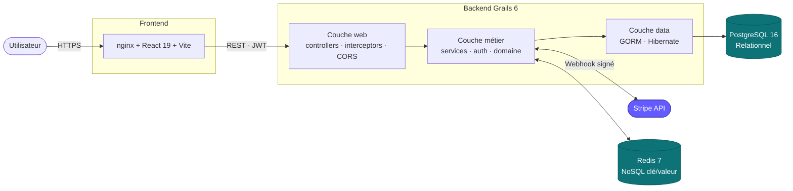

# Architecture

Application web monolithique modulaire, organisée en **architecture multicouche répartie** conformément aux recommandations ANSSI pour les applications sécurisées.



## Choix monolithe modulaire vs microservices

!!! tip "Décision d'architecture"
    Pour le périmètre fonctionnel et l'équipe (1 développeur), un **monolithe modulaire**
    est préférable aux microservices. Cohérence transactionnelle directe, déploiement unique,
    zéro latence inter-modules.

Pour le périmètre fonctionnel (boutique, permis, concours, carnet, leaderboard, admin) et l'équipe (1 développeur), un **monolithe modulaire** est préférable :

- **Cohérence transactionnelle simple** : une commande qui décrémente le stock et marque le paiement payé tient dans **une transaction Postgres**, sans saga distribuée ni eventual consistency.
- **Déploiement unique** : un seul livrable Docker → procédure de déploiement triviale, pas de service mesh, pas de versioning d'API inter-services.
- **Pas de réseau entre modules** : zéro latence inter-service, zéro retry/circuit breaker à câbler.

Le code reste organisé par **domaine fonctionnel** (catalogue, commande, paiement, permis, concours, carnet) — si un domaine devait un jour devenir un service séparé (ex. la facturation PDF), l'extraction reste possible car les services Grails sont déjà découplés.

## Stratégie de stockage : SQL + NoSQL

!!! abstract "Principe directeur"
    Le choix entre SQL et NoSQL se fait **par nature de la donnée**, pas par mode.
    On ne remplace pas Postgres par Redis : on les fait coexister, chacun sur son
    terrain de prédilection.

| Donnée | Volume | Cohérence requise | Latence cible | TTL | → Choix |
|---|---|---|---|---|---|
| Produits, commandes, lignes, users, permis, concours, avis | Faible-moyen | **ACID** stricte (FK, stocks, paiement) | < 100 ms | Permanent | **PostgreSQL** |
| Compteurs rate-limit auth (login, register, pwd-reset) | Élevé (≥ 1 hit / requête) | Atomicité `INCR` | **< 5 ms** | 60 s — 15 min | **Redis** |
| IDs events Stripe déjà traités (idempotence webhook) | Faible | Pas critique (defense in depth) | < 5 ms | 24 h | **Redis** |

### Pourquoi PostgreSQL pour le cœur métier
- **Contraintes d'intégrité** : foreign keys, `NOT NULL`, `CHECK`, unicité — la base refuse les états incohérents.
- **Transactions ACID** : `OrderService` enchaîne décrément du stock + création des lignes + persistance du PaymentIntent dans une transaction unique. Si quoi que ce soit échoue, rollback automatique.
- **Jointures et agrégats** : `StatsService` calcule CA, panier moyen, top produits sur 5 tables croisées — un store K/V ne peut pas faire ça.
- **Durabilité absolue** : la perte d'une commande coûterait de l'argent et de la confiance client.

### Pourquoi Redis (NoSQL) pour le rate-limit et l'idempotence
- **Performance** : `INCR` + `EXPIRE` se font en sub-milliseconde. Faire ça en Postgres ajouterait une jointure et un lock par requête d'auth.
- **TTL natif** : `EXPIRE key 60` côté Redis = pas de table à purger côté Postgres, pas de job cron à maintenir.
- **Atomicité K/V** : `INCR` est nativement atomique → pas de race-condition entre instances backend concurrentes. `SETNX` (set if not exists) idem pour l'idempotence.
- **Données éphémères** : si Redis crash, on perd des compteurs de rate-limit — acceptable (la fenêtre redémarre). Inacceptable pour une commande.
- **Partage entre instances** : si l'app scale en 2 backends derrière nginx, un compteur en mémoire locale permet à un attaquant d'**alterner les instances pour doubler son quota**. Redis partagé corrige ce trou.

## Cas d'usage Redis implémentés

### 1. Rate-limit anti-brute-force partagé — `RateLimitService`

!!! danger "Trou de sécurité corrigé"
    Avec un rate-limit en **mémoire locale**, déployer le backend en 2 instances
    derrière un load balancer permet à un attaquant d'**alterner les instances pour
    doubler son quota**. Redis partagé corrige ce trou en globalisant le compteur.

**Pourquoi** : OWASP Top 10 A07:2021 *Identification and Authentication Failures* recommande des compteurs **globaux** sur les endpoints d'auth. Sans ça, un attaquant peut tenter ~10⁴ couples login/password à la minute.

**Algorithme** : fixed-window counter.

```
INCR rl:<key>              → renvoie le nouveau compteur N
SI N == 1 : EXPIRE rl:<key> <windowSec>
allow ⇔ N <= maxRequests
```

| Endpoint | Clé | Plafond | Fenêtre |
|---|---|---|---|
| `POST /api/auth/register` | `register:<ip>` | 5 | 1 min |
| `POST /api/auth/login` | `login:<ip>` + `login:<email>` | 5 | 1 min |
| `POST /api/auth/forgot-password` | `pwd-reset:<email>` | 3 | 15 min |

**Fallback in-memory** : si Redis est indisponible, le service bascule sur un `ConcurrentHashMap` local. Le rate-limit reste fonctionnel mais redevient local à l'instance (mode dégradé). Un log d'avertissement est émis (throttle 1/min pour éviter le spam).

### 2. Idempotence des webhooks Stripe — `WebhookIdempotencyService`

!!! warning "Livraison at-least-once"
    Stripe garantit une livraison **at-least-once** des events. En cas de 5xx ou de
    timeout chez nous, Stripe **rejoue le même `event.id`**. Sans déduplication
    explicite, on risque de re-traiter le paiement (double email, etc.).

**Algorithme** :

```
SETNX webhook:stripe:<event.id> "1" EX 86400
  → true : premier passage, on traite
  → false : doublon, on retourne 200 sans rien faire
```

**Defense in depth** : `OrderService.markPaidByPaymentIntent()` est déjà idempotent au niveau base (test sur `status == 'paid'`). Redis ajoute une couche de **court-circuit avant DB** — court-circuit perf + protection contre les rares cas où un autre type d'event ferait re-basculer le statut.

**Fail-open** : si Redis est down, `acquire()` retourne `true` (on laisse passer) plutôt que de refuser. Refuser ferait retry Stripe en boucle exponentielle et pourrait faire désactiver le endpoint webhook.

## Sécurité (DICP par couche)

| Couche | Disponibilité | Intégrité | Confidentialité | Preuve |
|---|---|---|---|---|
| Frontend | Cache CDN, lazy loading | CSP stricte, SRI possible | HTTPS + CSP `script-src 'self'` | Logs nginx |
| API | Healthcheck, fallback Redis | Validation entrées, transactions GORM | JWT HS512, BCrypt 12 rounds | Audit logs (à venir) |
| DB | `pg_dump` programmable, bind localhost | FK, contraintes, types stricts | Auth par mot de passe + bind localhost | WAL Postgres |
| Redis | Healthcheck, mode dégradé | Atomicité INCR/SETNX | Pas exposé hors réseau Docker | N/A (données éphémères) |

## Éco-conception identifiée

- **Frontend** : code-splitting route-level, vendor chunks, lazy loading des images, WebP, dimensions explicites pour éviter le reflow.
- **Backend** : `actuator/health` seul exposé en prod (pas d'`/env` ni `/heapdump`).
- **CSS** : utilities locales plutôt que framework lourd → bundle réduit.
- **Redis** : compteurs éphémères en RAM uniquement (`save ""`, `appendonly no`) — pas d'I/O disque inutile.

## Références
- ANSSI — [Recommandations pour la sécurisation d'un site web](https://www.ssi.gouv.fr/uploads/IMG/pdf/NP_Securite_Web_NoteTech.pdf)
- OWASP — [Top 10 2021](https://owasp.org/Top10/)
- Référentiel Général d'Amélioration de l'Accessibilité — [RGAA 4](https://accessibilite.numerique.gouv.fr/)
