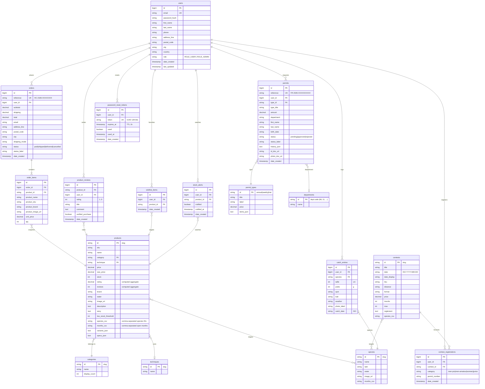

# Database schema — Hook & Cook

Entity-relationship diagram of the Postgres tables, derived from the
Grails domain classes (`backend/grails-app/domain/backend/`) and the SQL
seed (`postgres/init/01-init.sql`).

## Overview

## Key relationships

| Relationship | Cardinality | Notes |
|---|---|---|
| `users` → `orders` | 1..N | `user_id` not nullable |
| `orders` → `order_items` | 1..N | cascade delete, product snapshot (no hard FK to `products`) |
| `users` → `permits` | 1..N | one user may hold several historical permits |
| `users` → `contest_registrations` | 1..N | unique index (`user_id`, `contest_id`) enforced at the service level |
| `contests` → `contest_registrations` | 1..N | denormalised `inscrits` counter on `contests` |
| `users` → `catch_entries` | 1..N | catch log is private by default |
| `users` → `product_reviews` | 1..N | service-level constraint: a single review per (user, product) |
| `users` → `wishlist_items` | 1..N | one item per (user, product) — idempotent at the service level |
| `users` → `stock_alerts` | 1..N | active alerts filterable via `notified = false` |
| `users` → `password_reset_tokens` | 1..N | older tokens invalidated on each new request |
| `products` ↔ `species` | N..N | stored as CSV in `species_csv` (no join table) |
| `products` ↔ `months` | N..N | likewise, CSV in `months_csv` |

## Conventions

- **Slug IDs** for reference entities (`products`, `categories`, `species`, etc.) → readable URLs.
- **Hibernate auto-increment IDs** for transactional entities (`users`, `orders`, `permits`, …).
- **UUID-derived references** (`HC-2186-XXXXXXXX`, `FR-2026-XXXXXXXXXX`) for entities exposed to clients, to prevent enumeration.
- **JSON-in-text** for `*_json` columns (variants, specs, history, items): deserialised via Groovy `JsonSlurper` in the `toApiMap()` getters of the domain classes.
- **CSV for short lists** (`species_csv`, `months_csv`): handy for `LIKE '%,truite,%'` queries and avoids a dedicated join table at low cardinalities.

## Explicit indexes

All declared via `static mapping { }` in the domain classes:

| Table | Index | Column |
|---|---|---|
| `users` | `users_email_idx` | `email` |
| `orders` | `orders_reference_idx` | `reference` |
| `orders` | `orders_user_idx` | `user_id` |
| `permits` | `permits_reference_idx` | `reference` |
| `permits` | `permits_user_idx` | `user_id` |
| `contest_registrations` | `contest_reg_user_idx` | `user_id` |
| `contest_registrations` | `contest_reg_contest_idx` | `contest_id` |
| `catch_entries` | `catch_entries_user_idx` | `user_id` |
| `product_reviews` | `product_reviews_product_idx` | `product_id` |
| `product_reviews` | `product_reviews_user_idx` | `user_id` |
| `wishlist_items` | `wishlist_user_idx` | `user_id` |
| `wishlist_items` | `wishlist_product_idx` | `product_id` |
| `stock_alerts` | `stock_alerts_user_idx` | `user_id` |
| `stock_alerts` | `stock_alerts_product_idx` | `product_id` |
| `password_reset_tokens` | `pwd_reset_token_idx` (unique) | `token` |
| `password_reset_tokens` | `pwd_reset_user_idx` | `user_id` |

## Schema generation and evolution

- **First run**: `postgres/init/01-init.sql` (loaded automatically by the Postgres image at first boot of an empty volume) creates the full schema and the business reference data.
- **Subsequent evolutions**: Grails is configured with `dbCreate: update` (see `backend/grails-app/conf/application.yml`). Columns and tables added in the domain classes are created on the next startup.
- **BootStrap** (`backend/grails-app/init/backend/BootStrap.groovy`) idempotently seeds tables added after the initial dump: `permit_types`, `departments`, and the admin account (from `ADMIN_EMAIL` / `ADMIN_PASSWORD`).
- **Dumping the current state**: `bash scripts/dump.sh` regenerates `01-init.sql` from the live DB (handy before a commit).

## Visual rendering

The Mermaid block above is rendered directly by GitHub in the "Preview" tab of this file. For a high-resolution PNG / SVG export:

- Paste the block into [mermaid.live](https://mermaid.live)
- Or install the Mermaid CLI: `npm install -g @mermaid-js/mermaid-cli` then `mmdc -i docs/ERD.md -o docs/ERD.png`
