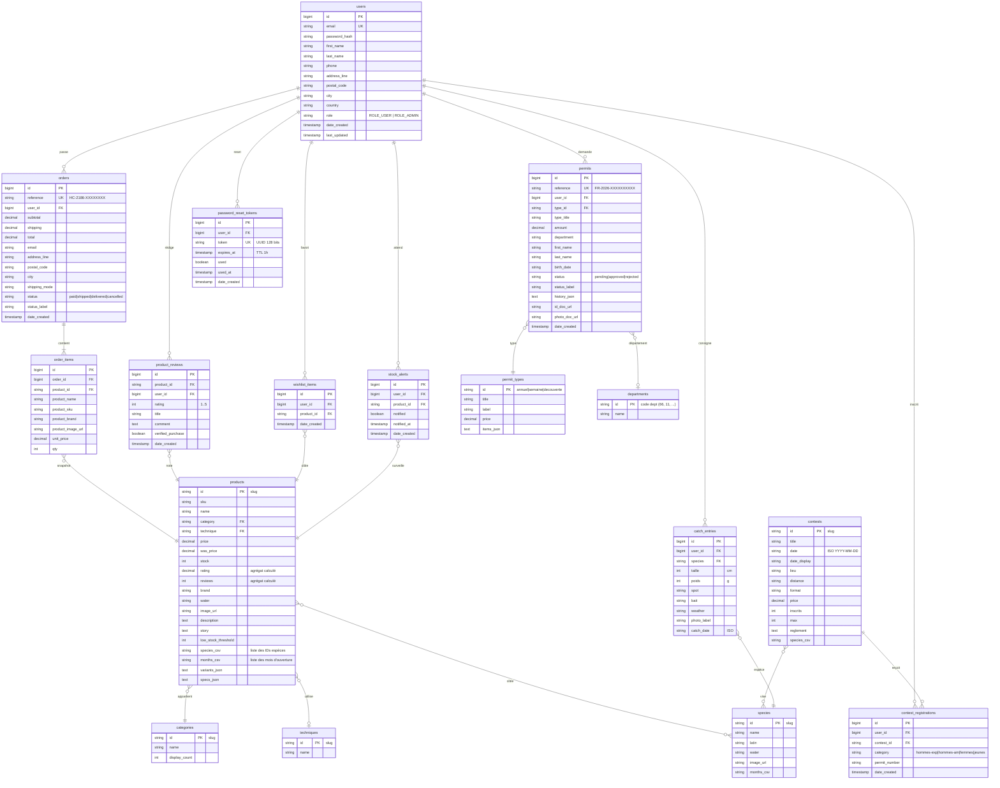

# Schéma de la base de données — Hook & Cook

Diagramme entité-relation des tables Postgres, généré depuis les domain
classes Grails (`backend/grails-app/domain/backend/`) et le seed SQL
(`postgres/init/01-init.sql`).

## Vue d'ensemble

## Relations clés

| Relation | Cardinalité | Particularités |
|---|---|---|
| `users` → `orders` | 1..N | `user_id` nullable:false |
| `orders` → `order_items` | 1..N | cascade delete, snapshot produit (pas de FK dure vers products) |
| `users` → `permits` | 1..N | un utilisateur peut avoir plusieurs permis historiques |
| `users` → `contest_registrations` | 1..N | index unique (`user_id`, `contest_id`) via logique applicative |
| `contests` → `contest_registrations` | 1..N | compteur `inscrits` dénormalisé sur `contests` |
| `users` → `catch_entries` | 1..N | le carnet de prises est privé par défaut |
| `users` → `product_reviews` | 1..N | contrainte applicative : un seul avis par couple (user, product) |
| `users` → `wishlist_items` | 1..N | un seul item par couple (user, product) — idempotence côté service |
| `users` → `stock_alerts` | 1..N | alertes actives filtrables via `notified = false` |
| `users` → `password_reset_tokens` | 1..N | anciens tokens invalidés à chaque nouvelle demande |
| `products` ↔ `species` | N..N | stocké en CSV dans `species_csv` (pas de table de jointure) |
| `products` ↔ `months` | N..N | idem, CSV dans `months_csv` |

## Conventions

- **IDs en slug** pour les entités référentielles (`products`, `categories`, `species`, etc.) → URLs lisibles.
- **IDs auto-increment Hibernate** pour les entités transactionnelles (`users`, `orders`, `permits`, …).
- **Références UUID-dérivées** (`HC-2186-XXXXXXXX`, `FR-2026-XXXXXXXXXX`) pour les entités exposées au client, pour éviter l'énumération.
- **JSON en texte** pour les colonnes `*_json` (variants, specs, history, items) : désérialisées via Groovy `JsonSlurper` dans le getter `toApiMap()` des domain classes.
- **CSV pour les listes courtes** (`species_csv`, `months_csv`) : pratique pour les requêtes `LIKE '%,truite,%'`, évite une table de jointure dédiée pour une cardinalité faible.

## Indexes explicites

Tous déclarés via `static mapping { }` dans les domains :

| Table | Index | Colonne |
|---|---|---|
| `users` | `users_email_idx` | `email` |
| `orders` | `orders_reference_idx` | `reference` |
| `orders` | `orders_user_idx` | `user_id` |
| `permits` | `permits_reference_idx` | `reference` |
| `permits` | `permits_user_idx` | `user_id` |
| `contest_registrations` | `contest_reg_user_idx` | `user_id` |
| `contest_registrations` | `contest_reg_contest_idx` | `contest_id` |
| `catch_entries` | `catch_entries_user_idx` | `user_id` |
| `product_reviews` | `product_reviews_product_idx` | `product_id` |
| `product_reviews` | `product_reviews_user_idx` | `user_id` |
| `wishlist_items` | `wishlist_user_idx` | `user_id` |
| `wishlist_items` | `wishlist_product_idx` | `product_id` |
| `stock_alerts` | `stock_alerts_user_idx` | `user_id` |
| `stock_alerts` | `stock_alerts_product_idx` | `product_id` |
| `password_reset_tokens` | `pwd_reset_token_idx` (unique) | `token` |
| `password_reset_tokens` | `pwd_reset_user_idx` | `user_id` |

## Génération et évolution du schéma

- **Première exécution** : `postgres/init/01-init.sql` (chargé automatiquement par l'image Postgres au premier boot d'un volume vide) crée tout le schéma + le référentiel métier.
- **Évolutions ultérieures** : Grails est configuré avec `dbCreate: update` (voir `backend/grails-app/conf/application.yml`). Les colonnes et tables ajoutées dans les domains sont créées automatiquement au prochain démarrage.
- **BootStrap** (`backend/grails-app/init/backend/BootStrap.groovy`) seed idempotemment les tables ajoutées après le dump initial : `permit_types`, `departments`, et le compte admin (depuis `ADMIN_EMAIL` / `ADMIN_PASSWORD`).
- **Dump de l'état courant** : `bash scripts/dump.sh` régénère `01-init.sql` depuis la BDD live (utile avant un commit).

## Rendu visuel

Le bloc Mermaid ci-dessus est directement rendu par GitHub dans l'onglet « Preview » de ce fichier. Pour obtenir un export PNG / SVG haute définition :

- Copier le bloc dans [mermaid.live](https://mermaid.live)
- Ou installer la CLI Mermaid : `npm install -g @mermaid-js/mermaid-cli` puis `mmdc -i docs/ERD.md -o docs/ERD.png`
