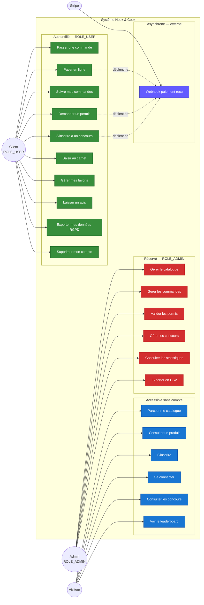
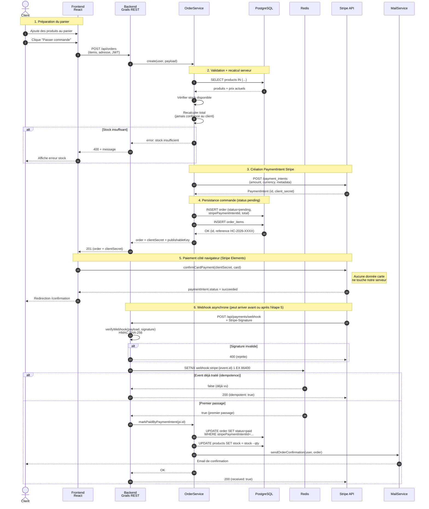
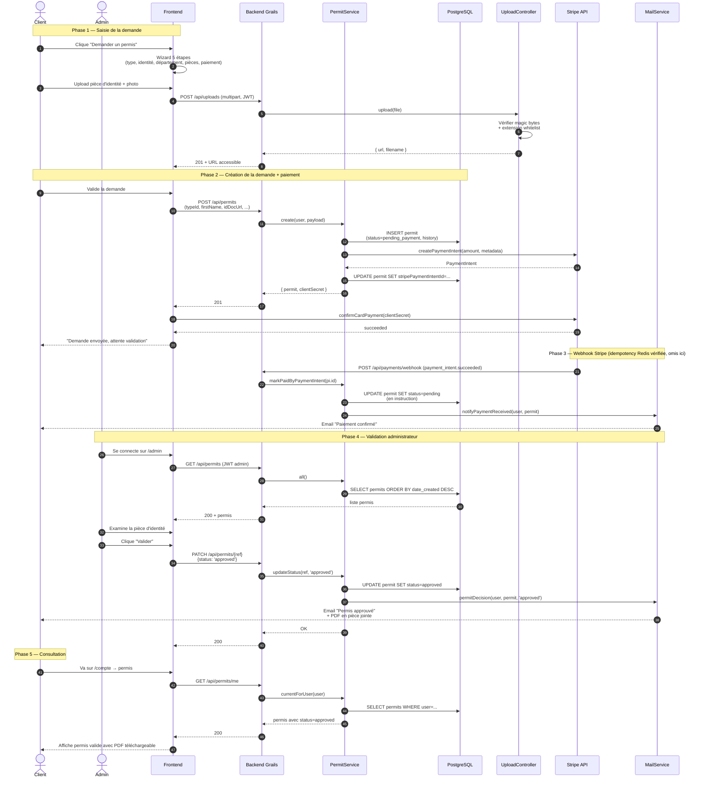
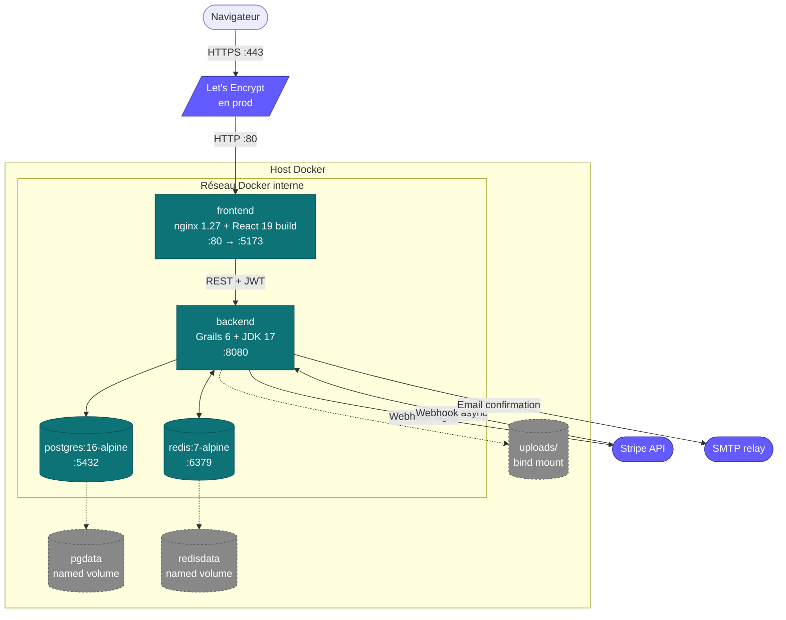

---
tags:
  - UML
  - Modélisation
  - CP5
  - CP6
---

# Modélisation UML

!!! abstract "Objectif"
    Cette page rassemble les **4 diagrammes UML de référence** du projet,
    rendus en **Mermaid** (visibles directement dans le site MkDocs et GitHub) :

    1. **Diagramme de cas d'utilisation** — vue globale des acteurs et fonctionnalités
    2. **Diagramme de séquence — commande Stripe** (fonctionnalité la plus représentative)
    3. **Diagramme de séquence — workflow permis**
    4. **Diagramme de composants Docker** — vue déploiement

    Les diagrammes d'architecture multicouche et le DICP sont dans
    [`ARCHITECTURE.md`](ARCHITECTURE.md) et [`SECURITE.md`](SECURITE.md).
    Le modèle entité-association est dans [`ERD.md`](ERD.md).

## 1. Diagramme de cas d'utilisation

Vue d'ensemble des acteurs (Visiteur, Client authentifié, Administrateur,
système Stripe) et des cas d'utilisation principaux du système.

### Lecture

- **Visiteur** (rond bleu) accède à la couche publique sans authentification : navigation produit, inscription, login, consultation des concours et du leaderboard.
- **Client** (rond vert) hérite des droits Visiteur + actions privées (commande, permis, concours, carnet, favoris, RGPD).
- **Admin** (rond rouge) hérite des droits Client + actions de gestion (catalogue, validation permis, stats).
- **Stripe** (rond violet) est un acteur externe qui déclenche le cas asynchrone *Webhook paiement reçu* après les actions de paiement (commande, permis, concours).
- Les **flèches pointillées** indiquent les déclencheurs asynchrones (`UC8 → UC23` : payer en ligne provoque la réception ultérieure du webhook Stripe).

## 2. Diagramme de séquence — Commande Stripe (fonctionnalité représentative)

Scénario nominal : un client authentifié passe une commande, paye avec
Stripe, et reçoit la confirmation par email après réception du webhook.

### Lecture

- **Étapes 1-2** : préparation côté client + validation serveur. Le total est **recalculé serveur** à partir du prix BDD — on ne fait jamais confiance au montant envoyé par le client (mitigation tampering OWASP A04).
- **Étape 3** : création du PaymentIntent côté Stripe — c'est Stripe qui détient le contrôle du paiement, on récupère juste le `clientSecret` à transmettre au front.
- **Étape 4** : la commande est créée en BDD avec **statut `pending`**. Pas de décrément stock à cette étape — on attend la confirmation Stripe.
- **Étape 5** : paiement effectué côté navigateur via **Stripe Elements**. La carte ne passe jamais par notre serveur (conformité PCI-DSS SAQ A).
- **Étape 6** : le webhook est asynchrone et peut arriver **avant ou après** la redirection front. Il est :
  - **Signé** (HMAC SHA-256, refus si invalide) — mitigation A08
  - **Idempotent** (SETNX Redis 24h) — résistance aux re-livraisons Stripe
  - Si premier passage : statut → `paid`, stock décrémenté, email envoyé.
  - Si re-livraison : court-circuit immédiat, on retourne 200 sans rien faire.

### Cas d'erreur couverts

- Signature webhook invalide → 400
- Event Stripe déjà traité → 200 idempotent
- Stock insuffisant à la création → 400 avec message clair
- Redis down → fail-open (l'idempotence de `markPaidByPaymentIntent` côté BDD prend le relais)
- Stripe API down → fallback en mode mock automatique (utile pour CI et démo)

## 3. Diagramme de séquence — Workflow permis

Scénario nominal : un client demande un permis annuel, paye, l'admin valide
la demande, l'utilisateur reçoit son PDF.

### Lecture

- **Phase 1** : upload sécurisé des pièces. Validation par **magic bytes** (un `.php` renommé en `.jpg` est rejeté à l'octet 0), nom de fichier UUID 128 bits (impossible à brute-forcer), accès restreint au propriétaire ou admin.
- **Phase 2** : la demande est créée en BDD avec `status=pending_payment`. Le PaymentIntent Stripe est créé immédiatement et son ID stocké pour permettre la corrélation au webhook.
- **Phase 3** : le webhook fait basculer le statut à `pending` (= en instruction admin). Email automatique.
- **Phase 4** : l'admin authentifié (`isAdmin()` vérifié à chaque appel) examine et valide. Email de décision envoyé avec PDF.
- **Phase 5** : le client consulte son permis dans son espace.

### Statuts possibles

| Statut | Description |
|---|---|
| `pending_payment` | Demande créée, en attente de paiement Stripe |
| `payment_failed` | Paiement échoué (carte refusée, 3DS abandonné, etc.) |
| `pending` | Paiement confirmé, en instruction admin |
| `approved` | Validé par l'admin, PDF envoyé |
| `rejected` | Refusé par l'admin avec motif |

## 4. Diagramme de composants Docker

Vue déploiement : organisation des conteneurs, ports exposés, dépendances
et bind mounts.

### Lecture

- **4 services** orchestrés par `docker-compose.yml` avec **healthchecks** :
  - `postgres` : `pg_isready -U $POSTGRES_USER -d $POSTGRES_DB`
  - `redis` : `redis-cli -a $REDIS_PASSWORD ping`
  - `backend` : `curl /actuator/health`
  - `frontend` : `wget --spider /`
- **Dépendances de boot** : `backend` ne démarre que si `postgres` et `redis`
  sont `service_healthy`. `frontend` ne démarre que si `backend` est `healthy`.
- **3 volumes** :
  - **`uploads/`** : bind mount du dossier repo `backend/uploads/` → permet d'ajouter
    des images sans rebuild de l'image Docker
  - **`pgdata`** : volume nommé, données Postgres durables (WAL inclus)
  - **`redisdata`** : volume nommé, AOF activé pour la durabilité Redis
- **Ports** :
  - Frontend `:5173` (mapping `5173:80`)
  - Backend `:8080`
  - Postgres et Redis **bind localhost** uniquement (`127.0.0.1:5432`, `127.0.0.1:6379`) — pas exposés sur le LAN
- **Externe** :
  - **Stripe** : double sens (création PaymentIntent côté backend + webhooks reçus)
  - **SMTP** : sortant uniquement (envoi emails confirmation, password reset, décisions permis)
  - **Let's Encrypt** : en prod seulement (reverse proxy + certificat TLS automatique)

### Sécurité au niveau conteneur

- **User non-root** dans backend et frontend (`uid 10001`) — réduit l'impact
  d'une RCE applicative.
- **Pas de port exposé non nécessaire** — actuator restreint à `health` + `info`.
- **Variables d'env via `.env`** — secrets jamais en clair dans l'image.

## Sources

- ANSSI — Recommandations sécurisation site web
- UML 2.5 specification (OMG)
- Mermaid — [Sequence Diagram syntax](https://mermaid.js.org/syntax/sequenceDiagram.html)
- Mermaid — [Flowchart syntax](https://mermaid.js.org/syntax/flowchart.html)

---

<small>
*Diagrammes maintenus à jour avec le code. En cas d'évolution majeure
de l'architecture, mettre à jour ici **en premier**, puis le code suit.*
</small>
