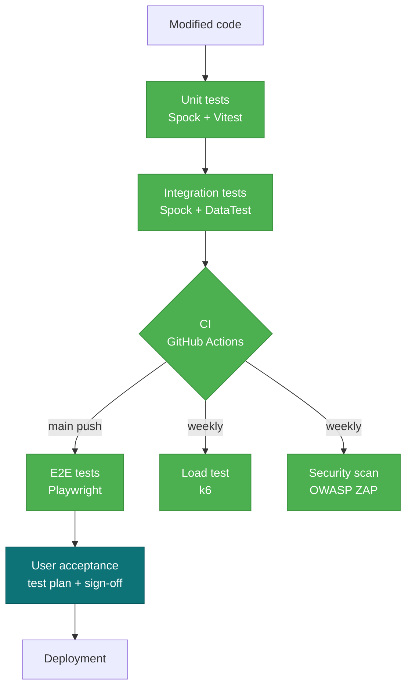

---
tags:
  - Tests
  - Quality
  - CP9
---

# Test plan

!!! abstract "Goal"
    Reference document for Hook & Cook's **testing strategy**, covering the
    **7 types of tests** expected by the CDA reference (CP9): unit,
    integration, regression, system (E2E), load, security, and acceptance.

## 1. Scope

### In scope

- **Grails backend**: business services, REST controllers, GORM persistence
- **React frontend**: UI components, state logic, API integrations
- **Key user journeys**: purchase, permit application, contest registration
- **Application security**: auth, rate-limit, idempotency, CSP, GDPR
- **Performance**: heavily read endpoints (catalogue, leaderboard)

### Out of scope

- Docker / deployment infrastructure (audited separately by the ZAP scan
  on the dockerised app and by manual validation of `docker compose up`)
- Low-level network security (TLS, firewall) — delegated to the hoster
- Heavy offensive penetration testing (outside the project's time budget)

## 2. Strategy



**Principle**: classic test pyramid. The bottom (unit tests) is massive and
fast (~seconds). We move up towards broader, slower, fewer tests. Manual
acceptance at the top only fires if the pyramid is green.

## 3. The 7 test types in place

=== ":material-flask: Unit"

    | Stack | Tool | Volume | Location |
    | --- | --- | --- | --- |
    | Backend | **Spock** (Groovy) | 140+ tests | `backend/src/test/groovy/backend/*Spec.groovy` |
    | Frontend | **Vitest** + Testing Library | 61 tests | `frontend/src/**/*.test.jsx` |

    **Acceptance criterion**: 100 % of PRs pass the unit suite in CI.
    Measured coverage:
    - Backend: **JaCoCo** (report `build/reports/jacoco/test/html/`)
    - Frontend: **v8 coverage** (report `frontend/coverage/`)

    Notable examples:
    - [`RateLimitServiceSpec`](https://github.com/S7venz/hook-cook/blob/main/backend/src/test/groovy/backend/RateLimitServiceSpec.groovy)
      — covers the 3 paths (nominal Redis, overflow, in-memory fallback)
    - [`WebhookIdempotencyServiceSpec`](https://github.com/S7venz/hook-cook/blob/main/backend/src/test/groovy/backend/WebhookIdempotencyServiceSpec.groovy)
      — covers idempotency + fail-open when Redis is unavailable

=== ":material-link-variant: Integration"

    Tests that validate the interaction between several components (service +
    DB, controller + service). Implemented with **Spock + `DataTest`** which
    spins up an H2 in-memory database with the GORM schema.

    | Target | Approach |
    | --- | --- |
    | GORM services (Order, Permit, Stats…) | DataTest with real entities |
    | REST controllers | ControllerUnitTest + mocked services |
    | Stripe webhook | Event mock + real StripeService + real OrderService |

    **Example**: [`PaymentControllerSpec`](https://github.com/S7venz/hook-cook/blob/main/backend/src/test/groovy/backend/PaymentControllerSpec.groovy)
    tests the full webhook flow from signature verification to Redis
    idempotency (mocked) through routing to OrderService/PermitService.

=== ":material-shield-refresh: Regression"

    **The full suite is replayed in CI** on every push to `main` and every PR.
    Any regression blocks merging.

    - Workflow [`ci.yml`](https://github.com/S7venz/hook-cook/blob/main/.github/workflows/ci.yml)
      → 2 parallel jobs, backend + frontend
    - Total time: ~3 min
    - Fails on a frontend ESLint warning (zero tolerance)

    !!! tip "Early detection"
        Combined with **Dependabot** (automated dep upgrades), the regression
        suite catches breakages introduced by a dependency bump before they
        reach production.

=== ":material-monitor-cellphone: System (E2E)"

    **Playwright 1.x + Chromium** on real user journeys. 5 spec files
    covering 12 scenarios:

    | Spec | Scenarios | Covers |
    | --- | --- | --- |
    | `01-smoke.spec.js` | 4 | Home, catalogue, permits, login load |
    | `02-auth.spec.js` | 3 | Admin login, wrong password, sign-up |
    | `03-catalogue.spec.js` | 2 | Search, navigation to product page |
    | `04-cart.spec.js` | 1 | Add to cart → check `/panier` |
    | `05-admin.spec.js` | 2 | Access denied, dashboard accessible |

    **Run them**:
    ```bash
    # Prerequisite: docker compose up -d
    cd frontend
    npx playwright test               # full suite
    npx playwright test --ui          # interactive mode
    npx playwright show-report        # HTML report after the run
    ```

    !!! note "Reset Redis before each login"
        The shared anti-brute-force rate-limit through Redis can lock the
        tests that log in sequentially. A `beforeEach` flushes Redis in the
        `02-auth` and `05-admin` specs to keep tests reproducible.

=== ":material-speedometer: Load"

    **k6** — modern tool, scriptable in JavaScript, CI-friendly.

    | Scenario | Target | Profile |
    | --- | --- | --- |
    | [`products-read.js`](https://github.com/S7venz/hook-cook/blob/main/scripts/load-tests/products-read.js) | `GET /api/products` | 1→50→100→0 VUs over 2m30 |

    **Contracted SLA thresholds**:
    - `http_req_duration p(95)` < **500 ms**
    - `http_req_failed rate` < **1 %**

    **Latest run results** (local Docker Compose on M1):

    | Metric | Measured | Threshold |
    | --- | :---: | :---: |
    | p(95) latency | **7.67 ms** :material-check-circle:{ style="color:#4caf50" } | < 500 ms |
    | HTTP errors | **0.00 %** :material-check-circle:{ style="color:#4caf50" } | < 1 % |
    | Total requests | 3,768 |  |
    | Peak throughput | 25 RPS |  |

    [:material-file-document: Full JSON report](./audits/k6/products-read-summary.json){ target="_blank" }

    !!! info "How to read the result"
        At 100 concurrent users at peak, the catalogue responds in **under
        10 ms** on the 95th percentile. The margin against the 500 ms SLA
        is huge — the app can absorb at least 10× the current traffic
        before saturating.

=== ":material-shield-search: Security"

    | Tool | Scope | When |
    | --- | --- | --- |
    | **OWASP ZAP baseline** | Passive scan of the dockerised frontend | Weekly (Monday 4 AM UTC) + manual |
    | **Security-focused Spock tests** | Rate-limit, idempotency, authorisation | Every PR |
    | **Pa11y + axe-core** | Accessibility (partial RGAA) | Manual + via `audits/run-audits.sh` |
    | **Dependabot** | CVEs in dependencies | Real-time |

    The [`security.yml`](https://github.com/S7venz/hook-cook/blob/main/.github/workflows/security.yml)
    workflow boots the Docker Compose stack, runs the ZAP Baseline Scan
    via `zaproxy/action-baseline`, and archives the HTML report as a
    GitHub artifact.

    Exception rules live in [`.zap/rules.tsv`](https://github.com/S7venz/hook-cook/blob/main/.zap/rules.tsv) — we
    start permissive (WARN everywhere) and tighten as findings are fixed.

=== ":material-account-check: Acceptance (manual)"

    !!! warning "Not yet executed — to be done before the defence"
        Acceptance tests are the only category that **cannot be automated**:
        they validate that the app meets the **user needs** as expressed in
        the specifications. A human clicks and signs.

    **Test plan template** (to be instantiated):

    | # | Case | Input data | Expected result | Observed | OK? |
    | --- | --- | --- | --- | --- | :---: |
    | 1 | Create customer account | email + password + name | Account created, redirected to `/compte` |  | ☐ |
    | 2 | Guest checkout | Cart with 3 products, test card 4242 | Confirmation email received |  | ☐ |
    | 3 | Annual permit application | ID document + test payment | Status "pending" in admin |  | ☐ |
    | 4 | Permit validation by admin | Admin login + "Validate" click | PDF emailed |  | ☐ |
    | 5 | Contest registration | Pick a contest + pay | Appears in the contestant list |  | ☐ |
    | 6 | Catch log entry | Photo + species + size | Appears in the leaderboard |  | ☐ |
    | 7 | GDPR data export | "Download my data" click from `/compte` | ZIP with compliant JSON |  | ☐ |
    | 8 | GDPR account deletion | "Delete my account" + confirmation | Email anonymised, data purged |  | ☐ |

    **Sign-off document** signed at the end of the session by the tester and
    the candidate.

## 4. Environments

| Environment | URL | Data | Usage |
| --- | --- | --- | --- |
| **DEV local** | `http://localhost:5173` | Demo seed (10 users, 18 orders…) | Day-to-day development |
| **TEST CI** | ephemeral jobs | H2 in-memory + temp Postgres container | Auto tests on each PR |
| **UAT** (acceptance) | local docker compose | Demo seed | Manual acceptance tests |
| **PROD** (upcoming) | hookcook.fr | Real | To be deployed for the defence |

## 5. Metrics and entry/exit criteria

### Entry criteria (before testing can start)

- [x] The app compiles (`./gradlew build && npm run build`)
- [x] Docker Compose brings all 4 services to healthy
- [x] The API answers `200` on `GET /api/products`
- [x] The frontend answers `200` on `/`

### Exit criteria (to validate a release)

- [ ] 100 % of unit tests pass (backend + frontend)
- [ ] 100 % of E2E tests pass
- [ ] k6: p(95) < 500 ms, errors < 1 %
- [ ] ZAP: 0 High alerts (Medium/Low triaged case-by-case)
- [ ] Lighthouse Best Practices ≥ 90 on the home page
- [ ] User acceptance plan signed by at least 1 user

## 6. Tooling and automation

<div class="grid cards" markdown>

-   :material-language-groovy: &nbsp; **Spock + DataTest**

    ---

    Backend unit + integration tests. Spins up H2 in-memory for DataTest.
    JaCoCo coverage integrated.

-   :material-react: &nbsp; **Vitest + Testing Library**

    ---

    Frontend unit tests, mocking via `vi.mock()`, v8 coverage.

-   :material-monitor-cellphone: &nbsp; **Playwright**

    ---

    E2E on headless Chromium. Traces + screenshots + video on failure.

-   :material-speedometer: &nbsp; **k6**

    ---

    Load tests in JavaScript, declarative SLA thresholds, JSON export.

-   :material-shield-bug: &nbsp; **OWASP ZAP baseline**

    ---

    Weekly passive scan via GitHub Actions, HTML reports as artifacts.

-   :material-magnify-scan: &nbsp; **Pa11y + Lighthouse**

    ---

    Partial RGAA accessibility + performance, run via `audits/run-audits.sh`.

</div>

## 7. Defect handling

- **Blocking bug** (journey broken) → GitHub issue labelled `priority:high`,
  fix on a dedicated branch, PR with mandatory regression test
- **Major bug** (degraded UX) → backlog, fix during the current sprint
- **Minor / cosmetic bug** → backlog, fix opportunistically
- **Security vulnerability** → private issue, immediate fix on main,
  post-mortem in [VEILLE](VEILLE.md)

---

<small>
*Last update: 2026-05-26. Re-read before each release.*
</small>
