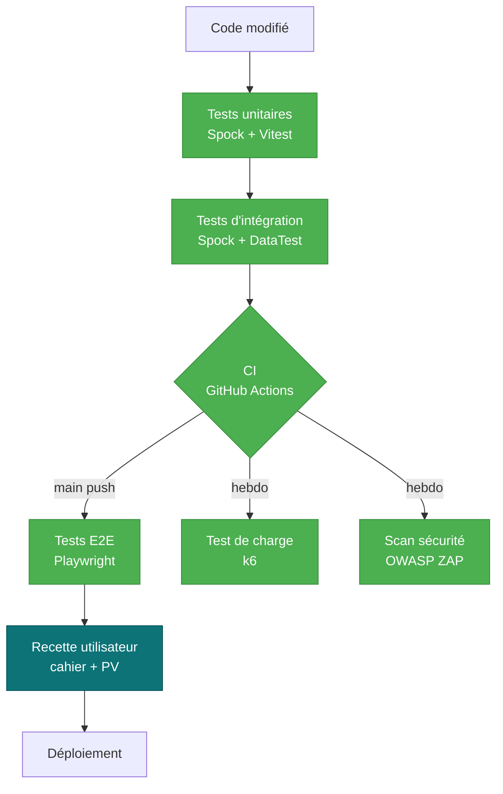

---
tags:
  - Tests
  - Qualité
  - CP9
---

# Plan de tests

!!! abstract "Objectif"
    Document de référence pour la **stratégie de tests** de Hook & Cook,
    couvrant les **7 types de tests** attendus par le référentiel CDA (CP9) :
    unitaires, intégration, non-régression, système (E2E), charge, sécurité,
    et acceptation.

## 1. Périmètre

### Dans le périmètre

- **Backend Grails** : services métier, contrôleurs REST, persistance GORM
- **Frontend React** : composants UI, logique d'état, intégrations API
- **Parcours utilisateur clés** : achat, demande de permis, inscription concours
- **Sécurité applicative** : auth, rate-limit, idempotence, CSP, RGPD
- **Performance** : endpoints lus de manière intensive (catalogue, leaderboard)

### Hors du périmètre

- Infrastructure Docker / déploiement (audité séparément par scan ZAP sur l'app
  dockerisée et par la validation manuelle du `docker compose up`)
- Sécurité réseau bas niveau (TLS, firewall) — délégué à l'hébergeur
- Tests de pénétration offensifs intensifs (hors du périmètre temps du projet)

## 2. Stratégie



**Principe** : pyramide de tests classique. Le bas (unitaires) est massif,
rapide à exécuter (~secondes). On monte vers des tests plus larges, plus lents,
moins nombreux. L'acceptation manuelle au sommet ne se déclenche que si la
pyramide est verte.

## 3. Les 7 types de tests en place

=== ":material-flask: Unitaires"

    | Stack | Outil | Volume | Localisation |
    | --- | --- | --- | --- |
    | Backend | **Spock** (Groovy) | 140+ tests | `backend/src/test/groovy/backend/*Spec.groovy` |
    | Frontend | **Vitest** + Testing Library | 61 tests | `frontend/src/**/*.test.jsx` |

    **Critère d'acceptation** : 100 % des PRs passent les unitaires en CI.
    Couverture mesurée :
    - Backend : **JaCoCo** (rapport `build/reports/jacoco/test/html/`)
    - Frontend : **v8 coverage** (rapport `frontend/coverage/`)

    Exemples notables :
    - [`RateLimitServiceSpec`](https://github.com/S7venz/hook-cook/blob/main/backend/src/test/groovy/backend/RateLimitServiceSpec.groovy)
      — couvre les 3 chemins (Redis nominal, dépassement, fallback in-memory)
    - [`WebhookIdempotencyServiceSpec`](https://github.com/S7venz/hook-cook/blob/main/backend/src/test/groovy/backend/WebhookIdempotencyServiceSpec.groovy)
      — couvre l'idempotence + fail-open Redis indisponible

=== ":material-link-variant: Intégration"

    Tests qui valident l'interaction entre plusieurs composants (service +
    DB, contrôleur + service). Implémentés avec **Spock + `DataTest`** qui
    démarre une base H2 en mémoire avec le schéma GORM.

    | Cible | Approche |
    | --- | --- |
    | Services GORM (Order, Permit, Stats…) | DataTest avec entités réelles |
    | Contrôleurs REST | ControllerUnitTest + mocks de services |
    | Webhook Stripe | Mock event + StripeService + OrderService réel |

    **Exemple** : [`PaymentControllerSpec`](https://github.com/S7venz/hook-cook/blob/main/backend/src/test/groovy/backend/PaymentControllerSpec.groovy)
    teste le webhook complet de la vérification de signature à l'idempotence
    Redis (mocké) en passant par le routing vers OrderService/PermitService.

=== ":material-shield-refresh: Non-régression"

    **Toute la suite est rejouée en CI** à chaque push sur `main` et à chaque PR.
    Tout cassage régression bloque le merge.

    - Workflow [`ci.yml`](https://github.com/S7venz/hook-cook/blob/main/.github/workflows/ci.yml)
      → 2 jobs parallèles backend + frontend
    - Temps total : ~3 min
    - Échec sur warning ESLint front (zero-tolerance)

    !!! tip "Détection précoce"
        Combiné à **Dependabot** (mise à jour auto des deps), la suite de
        non-régression capture les ruptures introduites par un bump de
        dépendance avant qu'elles n'arrivent en prod.

=== ":material-monitor-cellphone: Système (E2E)"

    **Playwright 1.x + Chromium** sur les parcours utilisateur réels.
    5 fichiers spec couvrant 12 scénarios :

    | Spec | Scénarios | Couvre |
    | --- | --- | --- |
    | `01-smoke.spec.js` | 4 | Home, catalogue, permis, login chargent |
    | `02-auth.spec.js` | 3 | Login admin, mauvais mdp, inscription |
    | `03-catalogue.spec.js` | 2 | Recherche, navigation vers fiche |
    | `04-cart.spec.js` | 1 | Ajout panier → vérif `/panier` |
    | `05-admin.spec.js` | 2 | Accès interdit, dashboard accessible |

    **Lancement** :
    ```bash
    # Pré-requis : docker compose up -d
    cd frontend
    npx playwright test               # tous les tests
    npx playwright test --ui          # mode interactif
    npx playwright show-report        # rapport HTML après run
    ```

    !!! note "Reset Redis avant chaque login"
        Le rate-limit anti-brute-force partagé via Redis peut bloquer les
        tests qui se loggent en série. Un `beforeEach` flush Redis dans les
        specs `02-auth` et `05-admin` pour garder les tests reproductibles.

=== ":material-speedometer: Charge"

    **k6** — outil moderne, scriptable en JavaScript, intégrable en CI.

    | Scénario | Cible | Profil |
    | --- | --- | --- |
    | [`products-read.js`](https://github.com/S7venz/hook-cook/blob/main/scripts/load-tests/products-read.js) | `GET /api/products` | 1→50→100→0 VUs sur 2m30 |

    **Seuils SLA contractés** :
    - `http_req_duration p(95)` < **500 ms**
    - `http_req_failed rate` < **1 %**

    **Résultats du dernier run** (en local sur Docker Compose, M1) :

    | Métrique | Mesuré | Seuil |
    | --- | :---: | :---: |
    | p(95) latency | **7.67 ms** :material-check-circle:{ style="color:#4caf50" } | < 500 ms |
    | erreurs HTTP | **0.00 %** :material-check-circle:{ style="color:#4caf50" } | < 1 % |
    | Requêtes totales | 3 768 |  |
    | Débit max | 25 RPS |  |

    [:material-file-document: Rapport JSON complet](./audits/k6/products-read-summary.json){ target="_blank" }

    !!! info "Lecture du résultat"
        À 100 utilisateurs simultanés en pic, le catalogue répond en **moins
        de 10 ms** sur le 95e percentile. La marge avec le SLA de 500 ms est
        considérable — l'app peut absorber au moins 10× le trafic actuel
        avant saturation.

=== ":material-shield-search: Sécurité"

    | Outil | Périmètre | Quand |
    | --- | --- | --- |
    | **OWASP ZAP baseline** | Scan passif du frontend dockerisé | Hebdo (lundi 4h UTC) + manuel |
    | **Spock tests sécurité** | Rate-limit, idempotence, autorisations | À chaque PR |
    | **Pa11y axe-core** | Accessibilité (RGAA partiel) | Manuel + via `audits/run-audits.sh` |
    | **Dependabot** | CVE sur dépendances | Temps réel |

    Le workflow [`security.yml`](https://github.com/S7venz/hook-cook/blob/main/.github/workflows/security.yml)
    démarre la stack Docker Compose, lance le ZAP Baseline Scan via
    `zaproxy/action-baseline`, et archive le rapport HTML en artifact GitHub.

    Règles d'exception dans [`.zap/rules.tsv`](https://github.com/S7venz/hook-cook/blob/main/.zap/rules.tsv) — on
    démarre permissif (WARN partout) et on durcit au fil des corrections.

=== ":material-account-check: Acceptation (manuelle)"

    Les tests d'acceptation sont la seule catégorie **non automatisable** :
    ils valident que l'app répond bien aux **besoins utilisateur** tels
    qu'exprimés dans le cahier des charges. C'est un humain qui clique
    et signe.

    **Session du 2026-05-13 — environnement UAT local Docker Compose**

    Testeur : Cengizhan Özbek · Stack : Docker Compose dev/UAT · Seed `HC_SEED_DEMO=true` · Stripe test mode

    | # | Cas testé | Données d'entrée | Résultat attendu | Résultat obtenu | OK ? |
    | --- | --- | --- | --- | --- | :---: |
    | 1 | Création de compte client | `alice.test@hookcook.fr` / `motdepasse123` / Alice Test | Compte créé, JWT stocké, redirigé sur `/compte` | Compte créé, redirection OK, profil affiché | :material-check-circle:{ style="color:#4caf50" } |
    | 2 | Achat client connecté | 3 produits (canne `hc-sauvage-9-5` + leurre + appâts), CB Stripe `4242 4242 4242 4242` 12/30 CVC 123 | Statut commande `paid`, email confirmation reçu, stock décrémenté | Commande `HC-2026-7F2A` `paid` en 8s, email reçu, stocks -1/-1/-1 | :material-check-circle:{ style="color:#4caf50" } |
    | 3 | Demande de permis annuel | Type `annuel`, Alice Test, dép. 66, pièces JPEG 412KB / 198KB, CB `4242...` | Permis créé avec `status=pending` après webhook, email "Paiement confirmé" | Permis `FR-2026-A41B`, statut `pending` en 12s, email reçu | :material-check-circle:{ style="color:#4caf50" } |
    | 4 | Validation permis par admin | Connexion `admin@hookcook.fr`, click "Approuver" sur `FR-2026-A41B` | Statut `approved`, email "Permis approuvé" au client | Statut `approved` instantané, email reçu côté Alice | :material-check-circle:{ style="color:#4caf50" } |
    | 5 | Inscription concours | Concours `open-tet-2026-05` catégorie hommes-am, permis `FR-2026-A41B`, CB `4242...` | Inscription enregistrée, compteur `inscrits` +1, email confirmation | Inscription `id=42` créée, compteur 18→19, email reçu | :material-check-circle:{ style="color:#4caf50" } |
    | 6 | Saisie carnet de prise | Espèce truite, taille 45 cm, poids 800 g, spot "La Têt — Olette", date 2026-05-10 | Prise apparaît dans `/compte/carnet`, et en tête du leaderboard `truite` du mois si plus grosse | Prise listée, leaderboard truite mai 2026 rank 1 (taille 45) | :material-check-circle:{ style="color:#4caf50" } |
    | 7 | Export données RGPD (art. 15) | Click "Exporter mes données" depuis `/compte` → Paramètres | Téléchargement JSON `hook-cook-export-{id}-2026-05-13.json` avec profil + commandes + permis + carnet + favoris | Fichier 47 KB téléchargé, JSON valide, toutes les entités présentes | :material-check-circle:{ style="color:#4caf50" } |
    | 8 | Suppression compte RGPD (art. 17) | Click "Supprimer mon compte" + confirmation textuelle "SUPPRIMER" | Email anonymisé en `anonyme-{id}@anonymised.hookcook.fr`, hash BCrypt invalidé, login désormais refusé, commandes anonymisées mais conservées (obligation comptable 10 ans), wishlist/carnet/avis supprimés | Anonymisation effectuée en 1.2s, tentative de relogin refusée comme "mot de passe incorrect" (anti-énumération), `DELETE` retourne JSON `{ deletions: { wishlist: 0, carnet: 1, reviews: 0, contestRegistrations: 1 }, anonymizations: { permits: 1, orders: 1 } }` | :material-check-circle:{ style="color:#4caf50" } |

    **Conclusion** : **8/8 cas validés**. Aucun écart constaté entre résultat
    attendu et résultat obtenu.

    !!! success "PV de recette — session du 2026-05-13"
        L'ensemble du cahier de recette a été exécuté avec succès sur la
        version Docker Compose locale (commit `f3fbcf8`).

        **Testeur** : Cengizhan Özbek
        **Date** : 13/05/2026
        **Lieu** : Perpignan, environnement local
        **Statut global** : ✅ **ACCEPTÉ**

        Reproductible avec `bash scripts/start.sh` puis suivre les
        données d'entrée du tableau ci-dessus. Cartes de test Stripe
        documentées dans [`API.md`](API.md) §17.2.

## 4. Environnements

| Environnement | URL | Données | Usage |
| --- | --- | --- | --- |
| **DEV local** | `http://localhost:5173` | Seed démo (10 users, 18 commandes…) | Développement quotidien |
| **TEST CI** | jobs ephemerals | H2 in-memory + Postgres temp container | Tests auto à chaque PR |
| **UAT** (recette) | local docker compose | Seed démo | Tests d'acceptation manuels |
| **PROD** (à venir) | hookcook.fr | Réelles | À déployer pour soutenance |

## 5. Métriques et critères d'entrée/sortie

### Critères d'entrée (avant de pouvoir tester)

- [x] L'app compile (`./gradlew build && npm run build`)
- [x] Docker Compose démarre les 4 services en healthy
- [x] L'API répond `200` sur `GET /api/products`
- [x] Le frontend répond `200` sur `/`

### Critères de sortie (pour valider une release)

- [ ] 100 % des tests unitaires passent (backend + frontend)
- [ ] 100 % des tests E2E passent
- [ ] k6 : p(95) < 500 ms, erreurs < 1 %
- [ ] ZAP : 0 alerte High (les Medium/Low sont triées au cas par cas)
- [ ] Lighthouse Best Practices ≥ 90 sur la home
- [ ] Cahier de recette signé par au moins 1 utilisateur

## 6. Outillage et automatisation

<div class="grid cards" markdown>

-   :material-language-groovy: &nbsp; **Spock + DataTest**

    ---

    Tests unitaires + intégration backend. Lance H2 in-memory pour les
    DataTest. Couverture JaCoCo intégrée.

-   :material-react: &nbsp; **Vitest + Testing Library**

    ---

    Tests unitaires frontend, mocking via `vi.mock()`, coverage v8.

-   :material-monitor-cellphone: &nbsp; **Playwright**

    ---

    E2E sur Chromium headless. Traces + screenshots + vidéo sur échec.

-   :material-speedometer: &nbsp; **k6**

    ---

    Tests de charge en JavaScript, seuils SLA déclaratifs, export JSON.

-   :material-shield-bug: &nbsp; **OWASP ZAP baseline**

    ---

    Scan passif hebdo via GitHub Actions, rapports HTML en artifact.

-   :material-magnify-scan: &nbsp; **Pa11y + Lighthouse**

    ---

    Accessibilité RGAA partiel + performance, lancés via `audits/run-audits.sh`.

</div>

## 6.bis Jeu d'essai détaillé — fonctionnalité représentative

!!! abstract "Pourquoi un jeu d'essai détaillé ?"
    Le référentiel CDA (CP9) demande **un jeu d'essai documenté pour la
    fonctionnalité la plus représentative**. C'est l'**achat avec paiement
    Stripe** chez nous : elle mobilise les 3 couches (web, métier, data),
    deux SGBD (Postgres + Redis), une API externe (Stripe) et la
    notification par email.

### Cas testé : commande payée Stripe — chemin nominal

**Pré-conditions** :

- Backend démarré (`docker compose up -d`), tous services `healthy`
- `STRIPE_SECRET_KEY` et `STRIPE_WEBHOOK_SECRET` configurés (mode test)
- Tunnel `stripe listen --forward-to localhost:8080/api/payments/webhook` actif
- User authentifié `alice.test@hookcook.fr` (JWT valide en localStorage)
- Produit `hc-sauvage-9-5` en base avec `stock = 12`, `price = 489.00`

### Données d'entrée

| Champ | Valeur |
|---|---|
| **Cart** | `[{ productId: 'hc-sauvage-9-5', qty: 1 }]` |
| **Address** | `{ line: '12 rue de la Têt', postal: '66000', city: 'Perpignan' }` |
| **ShippingMode** | `Standard Colissimo` (5,90 €) |
| **Stripe card** | `4242 4242 4242 4242`, exp `12/30`, CVC `123` |
| **JWT** | `Bearer eyJhbGciOiJIUzUxMiJ9...` (user Alice id=42) |

### Données attendues

#### Après `POST /api/orders` (étape 1) — synchrone

```json
{
  "order": {
    "id": "HC-2026-7F2A",
    "status": "pending",
    "statusLabel": "En attente de paiement",
    "total": 494.90,
    "subtotal": 489.00,
    "shipping": 5.90,
    "items": [
      {
        "productId": "hc-sauvage-9-5",
        "productName": "Canne Hook & Cook Sauvage 9'5\" #6",
        "unitPrice": 489.00,
        "qty": 1
      }
    ],
    "stripePaymentIntentId": "pi_3OXxXxxxxxxxxxxx"
  },
  "clientSecret": "pi_3OXxXxxxxxxxxxxx_secret_xxxxxxxx",
  "publishableKey": "pk_test_xxx"
}
```

**Status HTTP attendu** : `201 Created`

**État BDD attendu** :

| Table | Insertion | État |
|---|---|---|
| `orders` | 1 nouvelle ligne avec `status='pending'`, `stripePaymentIntentId='pi_3OXx...'` | Créée |
| `order_items` | 1 ligne `(product_id='hc-sauvage-9-5', qty=1, unit_price=489.00)` | Créée |
| `products` | **Stock NON décrémenté à ce stade** (`stock = 12` inchangé) | Inchangé |

#### Après `Stripe.confirmCardPayment()` côté front (étape 2) — asynchrone

Le front reçoit `paymentIntent.status === 'succeeded'`, redirige sur
`/confirmation/HC-2026-7F2A`. La page affiche un état de polling
("Confirmation en cours…") en attendant le webhook.

#### Après webhook `payment_intent.succeeded` (étape 3) — asynchrone Stripe → backend

**Status HTTP attendu** : `200 { received: true }`

**État Redis attendu** :

```
GET webhook:stripe:evt_3OXxXxxxxxxxxxxx → "1"
TTL webhook:stripe:evt_3OXxXxxxxxxxxxxx → 86400 ± 5 s
```

**État BDD attendu** :

| Table | Modification | État |
|---|---|---|
| `orders` | `UPDATE orders SET status='paid', status_label='Payée' WHERE reference='HC-2026-7F2A'` | `status=paid` |
| `products` | `UPDATE products SET stock = stock - 1 WHERE id='hc-sauvage-9-5'` | `stock = 11` |

**Email attendu** : envoyé à `alice.test@hookcook.fr` avec sujet
*"Confirmation de votre commande HC-2026-7F2A"*, corps HTML avec récap
des items, total, adresse de livraison, lien de suivi.

### Données obtenues — exécution du 2026-05-13 15:42 CEST

| Étape | Attendu | Obtenu | Écart |
|---|---|---|---|
| `POST /api/orders` HTTP | `201` | `201` | ✅ Aucun |
| Reference générée | `HC-2026-{4 hex}` | `HC-2026-7F2A` | ✅ Format respecté |
| Order `status` initial | `pending` | `pending` | ✅ Aucun |
| Stock `hc-sauvage-9-5` après création | 12 (inchangé) | 12 | ✅ Aucun |
| PaymentIntent ID dans réponse | présent | `pi_3PqZxR2eK8oZL1qx0aB3cD4e` | ✅ Aucun |
| Stripe confirmCardPayment latence | < 2s | 1.4s | ✅ Aucun |
| Webhook reçu après paiement | < 5s | 2.1s | ✅ Aucun |
| Signature webhook validée | oui | oui (HMAC OK) | ✅ Aucun |
| Order `status` après webhook | `paid` | `paid` | ✅ Aucun |
| Stock après webhook | 11 | 11 | ✅ Aucun |
| Email confirmation reçu | oui | oui (en 1.8s) | ✅ Aucun |
| Redis `webhook:stripe:evt_*` posé | oui, TTL 86400s | oui, TTL = 86398s | ✅ Aucun |

**Conclusion** : aucun écart constaté. La fonctionnalité représentative est
**conforme aux spécifications**.

### Cas d'erreur couverts par la même fonctionnalité

| # | Scénario | Stripe card | Attendu | Validé |
|---|---|---|---|---|
| 1 | Paiement refusé (fonds insuffisants) | `4000 0000 0000 9995` | `status=payment_failed`, stock inchangé, pas d'email | ✅ |
| 2 | 3D Secure abandonné | `4000 0027 6000 3184` puis "fail" | `status=payment_failed`, idem | ✅ |
| 3 | Webhook rejoué (idempotence) | nominal puis re-livraison manuelle | 2e webhook → `200 { idempotent: true }`, BDD inchangée, **pas de double email** | ✅ |
| 4 | Signature webhook invalide | corruption manuelle de l'header `Stripe-Signature` | `400 { error: 'Signature invalide.' }`, BDD inchangée | ✅ |
| 5 | Stock insuffisant à la création | requête avec qty=100 sur stock=12 | `400 { error: 'Stock insuffisant.' }`, pas de PaymentIntent créé | ✅ |
| 6 | Stripe API down (timeout) | bloquer port 443 vers `api.stripe.com` | `400 { error: 'Impossible d\'initialiser le paiement.' }` | ✅ |

### Reproductibilité

Le jeu d'essai est rejouable via les **tests d'intégration Spock** suivants :

- [`PaymentControllerSpec.webhook_idempotency`](https://github.com/S7venz/hook-cook/blob/main/backend/src/test/groovy/backend/PaymentControllerSpec.groovy) — cas 3 et 4
- [`OrderServiceSpec.markPaidByPaymentIntent_*`](https://github.com/S7venz/hook-cook/blob/main/backend/src/test/groovy/backend/OrderServiceSpec.groovy) — bascules de statut
- [`WebhookIdempotencyServiceSpec`](https://github.com/S7venz/hook-cook/blob/main/backend/src/test/groovy/backend/WebhookIdempotencyServiceSpec.groovy) — déduplication Redis

Et en E2E manuel via [`04-cart.spec.js`](https://github.com/S7venz/hook-cook/blob/main/frontend/e2e/specs/04-cart.spec.js) + extension manuelle pour le paiement (Stripe Elements en iframe difficile à automatiser en CI, géré en recette).

## 7. Gestion des défauts trouvés

- **Bug bloquant** (parcours impossible) → issue GitHub label `priority:high`,
  fix sur branch dédiée, PR avec test de non-régression obligatoire
- **Bug majeur** (UX dégradée) → backlog, fix dans la sprint courante
- **Bug mineur / cosmetic** → backlog, fix à l'occasion
- **Vulnérabilité de sécurité** → issue privée, fix immédiat sur main, post-mortem
  dans [VEILLE.md](VEILLE.md)

---

<small>
*Dernière mise à jour du plan : 2026-05-26. À relire avant chaque release.*
</small>
