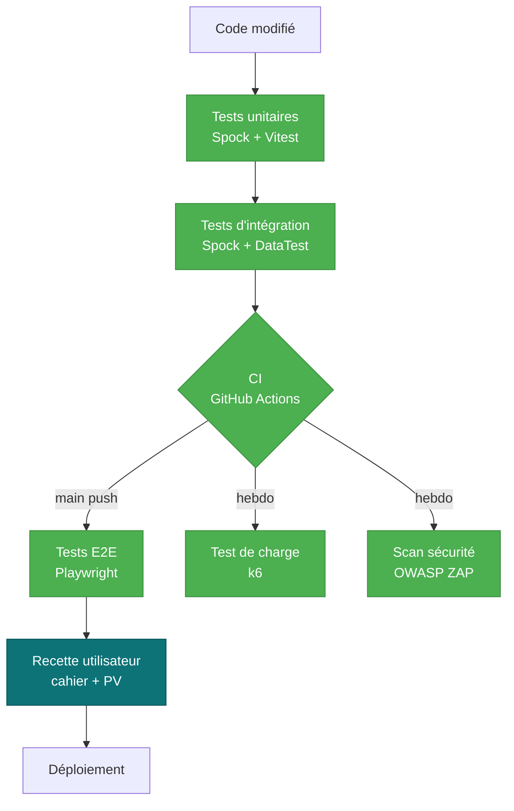

---
tags:
  - Tests
  - Qualité
  - CP9
---

# Plan de tests

!!! abstract "Objectif"
    Document de référence pour la **stratégie de tests** de Hook & Cook,
    couvrant les **7 types de tests** attendus par le référentiel CDA (CP9) :
    unitaires, intégration, non-régression, système (E2E), charge, sécurité,
    et acceptation.

## 1. Périmètre

### Dans le périmètre

- **Backend Grails** : services métier, contrôleurs REST, persistance GORM
- **Frontend React** : composants UI, logique d'état, intégrations API
- **Parcours utilisateur clés** : achat, demande de permis, inscription concours
- **Sécurité applicative** : auth, rate-limit, idempotence, CSP, RGPD
- **Performance** : endpoints lus de manière intensive (catalogue, leaderboard)

### Hors du périmètre

- Infrastructure Docker / déploiement (audité séparément par scan ZAP sur l'app
  dockerisée et par la validation manuelle du `docker compose up`)
- Sécurité réseau bas niveau (TLS, firewall) — délégué à l'hébergeur
- Tests de pénétration offensifs intensifs (hors du périmètre temps du projet)

## 2. Stratégie



**Principe** : pyramide de tests classique. Le bas (unitaires) est massif,
rapide à exécuter (~secondes). On monte vers des tests plus larges, plus lents,
moins nombreux. L'acceptation manuelle au sommet ne se déclenche que si la
pyramide est verte.

## 3. Les 7 types de tests en place

=== ":material-flask: Unitaires"

    | Stack | Outil | Volume | Localisation |
    | --- | --- | --- | --- |
    | Backend | **Spock** (Groovy) | 140+ tests | `backend/src/test/groovy/backend/*Spec.groovy` |
    | Frontend | **Vitest** + Testing Library | 61 tests | `frontend/src/**/*.test.jsx` |

    **Critère d'acceptation** : 100 % des PRs passent les unitaires en CI.
    Couverture mesurée :
    - Backend : **JaCoCo** (rapport `build/reports/jacoco/test/html/`)
    - Frontend : **v8 coverage** (rapport `frontend/coverage/`)

    Exemples notables :
    - [`RateLimitServiceSpec`](https://github.com/S7venz/hook-cook/blob/main/backend/src/test/groovy/backend/RateLimitServiceSpec.groovy)
      — couvre les 3 chemins (Redis nominal, dépassement, fallback in-memory)
    - [`WebhookIdempotencyServiceSpec`](https://github.com/S7venz/hook-cook/blob/main/backend/src/test/groovy/backend/WebhookIdempotencyServiceSpec.groovy)
      — couvre l'idempotence + fail-open Redis indisponible

=== ":material-link-variant: Intégration"

    Tests qui valident l'interaction entre plusieurs composants (service +
    DB, contrôleur + service). Implémentés avec **Spock + `DataTest`** qui
    démarre une base H2 en mémoire avec le schéma GORM.

    | Cible | Approche |
    | --- | --- |
    | Services GORM (Order, Permit, Stats…) | DataTest avec entités réelles |
    | Contrôleurs REST | ControllerUnitTest + mocks de services |
    | Webhook Stripe | Mock event + StripeService + OrderService réel |

    **Exemple** : [`PaymentControllerSpec`](https://github.com/S7venz/hook-cook/blob/main/backend/src/test/groovy/backend/PaymentControllerSpec.groovy)
    teste le webhook complet de la vérification de signature à l'idempotence
    Redis (mocké) en passant par le routing vers OrderService/PermitService.

=== ":material-shield-refresh: Non-régression"

    **Toute la suite est rejouée en CI** à chaque push sur `main` et à chaque PR.
    Tout cassage régression bloque le merge.

    - Workflow [`ci.yml`](https://github.com/S7venz/hook-cook/blob/main/.github/workflows/ci.yml)
      → 2 jobs parallèles backend + frontend
    - Temps total : ~3 min
    - Échec sur warning ESLint front (zero-tolerance)

    !!! tip "Détection précoce"
        Combiné à **Dependabot** (mise à jour auto des deps), la suite de
        non-régression capture les ruptures introduites par un bump de
        dépendance avant qu'elles n'arrivent en prod.

=== ":material-monitor-cellphone: Système (E2E)"

    **Playwright 1.x + Chromium** sur les parcours utilisateur réels.
    5 fichiers spec couvrant 12 scénarios :

    | Spec | Scénarios | Couvre |
    | --- | --- | --- |
    | `01-smoke.spec.js` | 4 | Home, catalogue, permis, login chargent |
    | `02-auth.spec.js` | 3 | Login admin, mauvais mdp, inscription |
    | `03-catalogue.spec.js` | 2 | Recherche, navigation vers fiche |
    | `04-cart.spec.js` | 1 | Ajout panier → vérif `/panier` |
    | `05-admin.spec.js` | 2 | Accès interdit, dashboard accessible |

    **Lancement** :
    ```bash
    # Pré-requis : docker compose up -d
    cd frontend
    npx playwright test               # tous les tests
    npx playwright test --ui          # mode interactif
    npx playwright show-report        # rapport HTML après run
    ```

    !!! note "Reset Redis avant chaque login"
        Le rate-limit anti-brute-force partagé via Redis peut bloquer les
        tests qui se loggent en série. Un `beforeEach` flush Redis dans les
        specs `02-auth` et `05-admin` pour garder les tests reproductibles.

=== ":material-speedometer: Charge"

    **k6** — outil moderne, scriptable en JavaScript, intégrable en CI.

    | Scénario | Cible | Profil |
    | --- | --- | --- |
    | [`products-read.js`](https://github.com/S7venz/hook-cook/blob/main/scripts/load-tests/products-read.js) | `GET /api/products` | 1→50→100→0 VUs sur 2m30 |

    **Seuils SLA contractés** :
    - `http_req_duration p(95)` < **500 ms**
    - `http_req_failed rate` < **1 %**

    **Résultats du dernier run** (en local sur Docker Compose, M1) :

    | Métrique | Mesuré | Seuil |
    | --- | :---: | :---: |
    | p(95) latency | **7.67 ms** :material-check-circle:{ style="color:#4caf50" } | < 500 ms |
    | erreurs HTTP | **0.00 %** :material-check-circle:{ style="color:#4caf50" } | < 1 % |
    | Requêtes totales | 3 768 |  |
    | Débit max | 25 RPS |  |

    [:material-file-document: Rapport JSON complet](./audits/k6/products-read-summary.json){ target="_blank" }

    !!! info "Lecture du résultat"
        À 100 utilisateurs simultanés en pic, le catalogue répond en **moins
        de 10 ms** sur le 95e percentile. La marge avec le SLA de 500 ms est
        considérable — l'app peut absorber au moins 10× le trafic actuel
        avant saturation.

=== ":material-shield-search: Sécurité"

    | Outil | Périmètre | Quand |
    | --- | --- | --- |
    | **OWASP ZAP baseline** | Scan passif du frontend dockerisé | Hebdo (lundi 4h UTC) + manuel |
    | **Spock tests sécurité** | Rate-limit, idempotence, autorisations | À chaque PR |
    | **Pa11y axe-core** | Accessibilité (RGAA partiel) | Manuel + via `audits/run-audits.sh` |
    | **Dependabot** | CVE sur dépendances | Temps réel |

    Le workflow [`security.yml`](https://github.com/S7venz/hook-cook/blob/main/.github/workflows/security.yml)
    démarre la stack Docker Compose, lance le ZAP Baseline Scan via
    `zaproxy/action-baseline`, et archive le rapport HTML en artifact GitHub.

    Règles d'exception dans [`.zap/rules.tsv`](https://github.com/S7venz/hook-cook/blob/main/.zap/rules.tsv) — on
    démarre permissif (WARN partout) et on durcit au fil des corrections.

=== ":material-account-check: Acceptation (manuelle)"

    !!! warning "Pas encore exécutée — à faire avant soutenance"
        Les tests d'acceptation sont la seule catégorie **non automatisable** :
        ils valident que l'app répond bien aux **besoins utilisateur** tels
        qu'exprimés dans le cahier des charges. C'est un humain qui clique
        et signe.

    **Cahier de recette** (template à instancier) :

    | # | Cas testé | Données d'entrée | Résultat attendu | Résultat obtenu | OK ? |
    | --- | --- | --- | --- | --- | :---: |
    | 1 | Création de compte client | email + mdp + nom | Compte créé, redirigé vers `/compte` |  | ☐ |
    | 2 | Achat invité | Panier de 3 produits, CB test 4242 | Email confirmation reçu |  | ☐ |
    | 3 | Demande de permis annuel | Pièce d'identité + paiement test | Statut "en attente" admin |  | ☐ |
    | 4 | Validation permis par admin | Connexion admin + click "Valider" | PDF envoyé par mail |  | ☐ |
    | 5 | Inscription concours | Choisir un concours + payer | Apparaît dans la liste des inscrits |  | ☐ |
    | 6 | Saisie carnet de prise | Photo + espèce + taille | Apparaît dans le leaderboard |  | ☐ |
    | 7 | Export données RGPD | Click "Télécharger mes données" depuis `/compte` | ZIP avec JSON conforme |  | ☐ |
    | 8 | Suppression compte RGPD | Click "Supprimer mon compte" + confirmation | Email anonymisé, données purgées |  | ☐ |

    **PV de recette** à signer en fin de session par le testeur + le candidat.

## 4. Environnements

| Environnement | URL | Données | Usage |
| --- | --- | --- | --- |
| **DEV local** | `http://localhost:5173` | Seed démo (10 users, 18 commandes…) | Développement quotidien |
| **TEST CI** | jobs ephemerals | H2 in-memory + Postgres temp container | Tests auto à chaque PR |
| **UAT** (recette) | local docker compose | Seed démo | Tests d'acceptation manuels |
| **PROD** (à venir) | hookcook.fr | Réelles | À déployer pour soutenance |

## 5. Métriques et critères d'entrée/sortie

### Critères d'entrée (avant de pouvoir tester)

- [x] L'app compile (`./gradlew build && npm run build`)
- [x] Docker Compose démarre les 4 services en healthy
- [x] L'API répond `200` sur `GET /api/products`
- [x] Le frontend répond `200` sur `/`

### Critères de sortie (pour valider une release)

- [ ] 100 % des tests unitaires passent (backend + frontend)
- [ ] 100 % des tests E2E passent
- [ ] k6 : p(95) < 500 ms, erreurs < 1 %
- [ ] ZAP : 0 alerte High (les Medium/Low sont triées au cas par cas)
- [ ] Lighthouse Best Practices ≥ 90 sur la home
- [ ] Cahier de recette signé par au moins 1 utilisateur

## 6. Outillage et automatisation

<div class="grid cards" markdown>

-   :material-language-groovy: &nbsp; **Spock + DataTest**

    ---

    Tests unitaires + intégration backend. Lance H2 in-memory pour les
    DataTest. Couverture JaCoCo intégrée.

-   :material-react: &nbsp; **Vitest + Testing Library**

    ---

    Tests unitaires frontend, mocking via `vi.mock()`, coverage v8.

-   :material-monitor-cellphone: &nbsp; **Playwright**

    ---

    E2E sur Chromium headless. Traces + screenshots + vidéo sur échec.

-   :material-speedometer: &nbsp; **k6**

    ---

    Tests de charge en JavaScript, seuils SLA déclaratifs, export JSON.

-   :material-shield-bug: &nbsp; **OWASP ZAP baseline**

    ---

    Scan passif hebdo via GitHub Actions, rapports HTML en artifact.

-   :material-magnify-scan: &nbsp; **Pa11y + Lighthouse**

    ---

    Accessibilité RGAA partiel + performance, lancés via `audits/run-audits.sh`.

</div>

## 7. Gestion des défauts trouvés

- **Bug bloquant** (parcours impossible) → issue GitHub label `priority:high`,
  fix sur branch dédiée, PR avec test de non-régression obligatoire
- **Bug majeur** (UX dégradée) → backlog, fix dans la sprint courante
- **Bug mineur / cosmetic** → backlog, fix à l'occasion
- **Vulnérabilité de sécurité** → issue privée, fix immédiat sur main, post-mortem
  dans [VEILLE.md](VEILLE.md)

---

<small>
*Dernière mise à jour du plan : 2026-05-26. À relire avant chaque release.*
</small>
