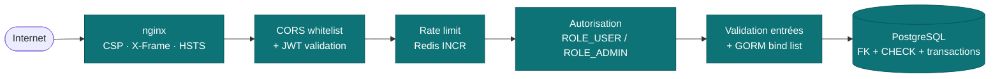

---
tags:
  - Sécurité
  - OWASP
  - DICP
  - ANSSI
  - CP3
  - CP6
  - CP8
---

# Spécifications de sécurité

!!! abstract "Pourquoi ce document"
    Document de référence **consolidé** des mesures de sécurité applicatives
    de Hook & Cook. Il croise trois grilles d'analyse :

    1. **OWASP Top 10 2021** — mapping point-par-point avec les défenses
       implémentées dans le code.
    2. **DICP** (Disponibilité / Intégrité / Confidentialité / Preuve) —
       analyse par couche selon le cadre ANSSI.
    3. **RGPD** — mesures techniques mises en place pour les droits des
       personnes (articles 15, 17, 20, 32).

    Les détails opérationnels (sources de veille CVE, audits) sont dans
    [`VEILLE.md`](VEILLE.md) et [`AUDITS.md`](AUDITS.md).

## 1. Approche défense en profondeur



**Principe** : chaque requête traverse **6 couches de défense** avant de
toucher les données. La compromission d'une couche ne suffit pas à
compromettre l'application — il faut percer la suivante.

| Couche | Mécanisme | Code source |
|---|---|---|
| 1. WAF applicatif | Headers HTTP sécurité, CSP stricte | `frontend/nginx.conf` |
| 2. CORS + JWT | Whitelist origins + signature HS512 | `CorsConfig.groovy`, `JwtService.groovy` |
| 3. Rate limit | INCR Redis partagé (anti-brute-force) | `RateLimitService.groovy` |
| 4. Autorisation | Rôles `ROLE_USER` / `ROLE_ADMIN` | `AuthService.isAdmin()` |
| 5. Validation | Type + format + plage + bind list | Domain constraints GORM + contrôleurs |
| 6. Intégrité données | FK + CHECK + transactions ACID | `postgres/init/01-init.sql` |

## 2. OWASP Top 10 2021 — mapping point-par-point

### A01:2021 — Broken Access Control 🟢

**Surface** : tout endpoint qui touche aux données utilisateur (`/api/orders/me`,
`/api/permits/me`, `/api/admin/*`).

**Défenses implémentées** :

- **Vérification systématique côté serveur** — chaque contrôleur appelle
  `authService.userFromRequest(request)` qui valide le JWT, puis re-vérifie
  les permissions sur la ressource (le user ne peut voir que SES commandes).
- **Test propriétaire avant chaque action** : `if (order.user.id != currentUser.id && !isAdmin) return 403`.
- **IDOR mitigation** — références opaques au lieu d'IDs incrémentaux : commandes au format `HC-{YYYY}-{8 hex}`, permis `FR-{YYYY}-{8 hex}` (cf. [`OrderService.generateReference()`](https://github.com/S7venz/hook-cook/blob/main/backend/grails-app/services/backend/OrderService.groovy)).
- **Anti-énumération** : messages d'erreur uniformes sur `DELETE` (un attaquant
  ne peut pas distinguer "ressource inexistante" de "ressource d'un autre user").
- **Routes admin** strictement filtrées par `URL Mappings` + check `isAdmin()`.

**Tests** :

- `AuthServiceSpec` — vérification du token + check rôle
- `OrderServiceSpec` — un user ne voit pas les commandes d'un autre
- E2E Playwright `05-admin.spec.js` — un user non-admin reçoit 403

### A02:2021 — Cryptographic Failures 🟢

**Surface** : mots de passe stockés, tokens d'authentification, données
transitant en clair.

**Défenses implémentées** :

- **Mots de passe** — hash **BCrypt facteur 12** (~250 ms par hash), pas de
  stockage en clair, pas de réversibilité.
  ```groovy
  // AuthService.groovy
  private static final BCryptPasswordEncoder ENCODER = new BCryptPasswordEncoder(12)
  user.passwordHash = ENCODER.encode(password)
  ```
- **Tokens JWT** — signature **HS512** (HMAC-SHA-512). Secret dans
  `HC_JWT_SECRET`, le backend refuse de démarrer en prod si la clé fait
  moins de 64 caractères.
- **TLS obligatoire en prod** — Let's Encrypt via reverse proxy
  (cf. [`DEPLOIEMENT.md`](DEPLOIEMENT.md)).
- **Pas de carte de paiement** stockée côté Hook & Cook — délégation
  intégrale à Stripe (PCI-DSS SAQ A — le niveau le plus simple, on n'est
  jamais en possession des données carte).
- **Webhook Stripe** — vérification HMAC SHA-256 de la signature (`Stripe-Signature` header) via le secret `STRIPE_WEBHOOK_SECRET` ; refus 503 si le secret n'est pas configuré.

**Conformité OWASP Password Storage Cheat Sheet 2023** :

| Recommandation | Notre conf | Statut |
|---|---|---|
| BCrypt work factor | 12 (recommandé 10+ minimum) | ✅ |
| Hash dédié auth (pas SHA-1/MD5) | BCrypt | ✅ |
| Salt unique par mot de passe | Inclus dans BCrypt | ✅ |
| TLS pour transmission mdp | Let's Encrypt en prod | ✅ |

### A03:2021 — Injection 🟢

**Surface** : tout endpoint qui prend un paramètre utilisateur et touche la
base ou le filesystem.

**Défenses implémentées** :

- **SQL injection** — **impossible par construction** : toutes les requêtes
  passent par GORM (dynamic finders + criteria) qui paramètre systématiquement.
  Zéro `executeQuery` avec interpolation directe dans le code.
  ```groovy
  // SAFE — paramétré automatiquement
  User.findByEmail(email)
  // SAFE — criteria buildés
  CatchEntry.createCriteria().list { eq('species', userInput) }
  ```
- **XSS reflected/stored** — React échappe par défaut tous les contenus
  dans le JSX. Aucun `dangerouslySetInnerHTML` avec contenu utilisateur.
  CSP `script-src 'self'` interdit l'injection de scripts inline.
- **Command injection** — pas d'appel à `Runtime.exec()` dans le code applicatif.
- **NoSQL injection** — clés Redis composées avec un préfixe fixe (`rl:`,
  `webhook:stripe:`) + valeur utilisateur, ce qui contraint la sémantique.
- **Path traversal** — l'endpoint `/api/uploads/{filename}` valide le
  filename : rejet si contient `/` ou `..` (cf. `UploadController.serve()`).
- **Header injection** — les contenus retournés via `setHeader()` ne
  contiennent jamais directement de données utilisateur (filename UUID
  généré côté serveur).

**Tests** :

- Tests Spock sur services métier — toutes les saisies passent par `as` casts
- ESLint `react/no-danger` bloquant sur le front
- Scan ZAP hebdomadaire (cf. `.github/workflows/security.yml`)

### A04:2021 — Insecure Design 🟢

**Surface** : architecture et workflows métier.

**Défenses by-design** :

- **Architecture multicouche** — séparation web / métier / data
  (cf. [`ARCHITECTURE.md`](ARCHITECTURE.md)). Le contrôleur ne touche
  jamais directement la DB.
- **Validation côté serveur** — toutes les contraintes métier (stock
  suffisant, prix recalculé serveur, permis valide à l'inscription
  concours…) sont vérifiées dans les services, jamais dans le frontend
  seul.
- **Idempotence webhook Stripe** — `WebhookIdempotencyService` protège
  contre la re-livraison Stripe (at-least-once delivery).
- **Anti-rollback financier** — montants commande **recalculés serveur**
  à partir du prix BDD, on n'accepte jamais le total envoyé par le client.

### A05:2021 — Security Misconfiguration 🟢

**Défenses implémentées** :

- **Headers de sécurité** sur toutes les réponses nginx (cf. `frontend/nginx.conf`) :
  ```
  Content-Security-Policy: default-src 'self'; ...
  X-Frame-Options: DENY
  X-Content-Type-Options: nosniff
  Referrer-Policy: strict-origin-when-cross-origin
  Permissions-Policy: geolocation=(), camera=(), microphone=()
  Strict-Transport-Security: max-age=31536000 (en prod)
  ```
- **Actuator restreint** — `application.yml` n'expose que `health` et `info`,
  même en dev. Plus de `/env` ni `/heapdump` qui dumperaient les secrets sur
  un Wi-Fi partagé.
- **CORS whitelist** — pas de `*`, liste explicite des origins autorisés
  par environnement.
- **Containers non-root** — `Dockerfile` backend et frontend utilisent un
  user `app` (uid 10001), pas root. Si une CVE permet une RCE, l'attaquant
  n'a pas les droits système.
- **Postgres + Redis bind localhost** — port `127.0.0.1:5432` et
  `127.0.0.1:6379` uniquement. Pas exposés sur le LAN même par accident.
- **Pas de credentials en clair en repo** — `.env` gitignored, secrets
  fournis via variables d'environnement Docker.

**Test** : audit nginx via ZAP baseline → header `Server` masqué, pas de
`X-Powered-By`, CSP appliquée.

### A06:2021 — Vulnerable and Outdated Components 🟢

**Défenses implémentées** :

- **Dependabot** activé sur le repo GitHub — PRs auto sur CVE des dépendances.
  Alertes immédiates pour `severity >= moderate`.
- **Veille manuelle complémentaire** — sources documentées dans
  [`VEILLE.md`](VEILLE.md) : ANSSI, NVD, GitHub Security Advisories,
  Spring Blog, react.dev, Stripe changelog.
- **Versions fixées explicitement** dans `build.gradle` et `package.json`
  (pas de wildcard) — reproductibilité du build, traçabilité des CVE.
- **Audits ponctuels** : `npm audit` côté front, `./gradlew dependencies`
  côté back pour repérer les transitives obsolètes.

**Stack actuelle (au 2026-05-13)** :

| Composant | Version | Dernier CVE patché |
|---|---|---|
| Grails | 6.2.3 | RCE objet sérialisé (n/a, on n'expose pas Java serialization) |
| Spring Framework | 5.3.30 (via Spring Boot 2.7) | CVE-2023-22968 |
| Spring Security crypto | 5.7.11 | — |
| PostgreSQL JDBC | 42.7.3 | CVE-2024-1597 |
| JJWT | 0.12.5 | n/a (HS512 symétrique) |
| Stripe Java SDK | 26.10.0 | suivi via stripe.com changelog |
| React | 19.x | — |
| Vite | 8.x | — |

### A07:2021 — Identification and Authentication Failures 🟢

**Défenses implémentées** :

- **Rate limit anti-brute-force partagé via Redis** — `RateLimitService` :
  - `POST /api/auth/login` : 5 essais / minute / IP **et** par email
  - `POST /api/auth/register` : 5 créations / minute / IP
  - `POST /api/auth/forgot-password` : 3 demandes / 15 min / email
- **Mot de passe oublié** :
  - Token UUID 128 bits (impossible à brute-forcer)
  - **Usage unique** + TTL 1h
  - Tous les tokens précédents invalidés à chaque nouvelle demande
  - **Anti-énumération** : message générique « si un compte existe, un email
    a été envoyé » — même réponse + même temps de réponse que l'email existe
    ou pas (`Thread.sleep(150)` artificiel pour égaliser les timings).
- **Anonymisation RGPD** — comptes anonymisés (suffixe
  `@anonymised.hookcook.fr`) rejetés au login avec le même message qu'un
  mot de passe faux, pour ne pas révéler qu'un compte a été supprimé.
- **Mot de passe** ≥ 8 caractères imposé côté serveur (front en plus
  pour l'UX mais jamais source de vérité).
- **Pas de password reset par questions secrètes** (vecteur d'ingénierie
  sociale connu).

**Tests** :

- `AuthServiceSpec` — login échoue après N tentatives
- `PasswordResetServiceSpec` — token usage unique + expiration
- `RateLimitServiceSpec` — fenêtre Redis + fallback in-memory

### A08:2021 — Software and Data Integrity Failures 🟢

**Défenses implémentées** :

- **Webhook Stripe signé HMAC SHA-256** — `StripeService.verifyWebhook()` rejette
  toute requête sans `Stripe-Signature` valide. Refus 503 si `STRIPE_WEBHOOK_SECRET`
  n'est pas configuré (mode dégradé sûr).
- **Idempotence Redis** — `WebhookIdempotencyService.acquire(event.id)` via
  `SETNX webhook:stripe:{event.id}` empêche le re-traitement d'un même event.
- **Pas de désérialisation Java** d'entrées non-fiables (Grails REST API
  utilise JSON via Jackson).
- **CI sur main protégée** — toutes les PRs doivent passer la suite de tests
  avant merge.
- **Containers Docker** construits depuis `Dockerfile` versionné, images
  base officielles (`postgres:16-alpine`, `redis:7-alpine`, `nginx:1.27-alpine`,
  `eclipse-temurin:17-jdk-jammy`).

### A09:2021 — Security Logging and Monitoring Failures 🟢

**Défenses implémentées** :

- **Logs structurés** via `slf4j` côté backend, niveaux différenciés
  (`INFO` exploitation, `WARN` situations anormales, `ERROR` erreurs réelles).
- **Logs d'audit auth** : `AuthService` log chaque login réussi/échoué
  avec email + IP (sans le mot de passe évidemment).
- **Logs webhook Stripe** : event ID + type loggés à chaque réception.
- **Rate limit dégradé loggé** : `RateLimitService.logFallback()` avec
  throttle 1/min pour éviter le log spam quand Redis tombe.
- **Healthchecks Docker** sur les 4 services — détection rapide des pannes.

**Améliorations possibles** (post-MVP) :

- Centralisation des logs (ELK ou équivalent) — pas en place sur le projet de
  fin d'année.
- Alerting sur métriques (Prometheus + Grafana) — idem.

### A10:2021 — Server-Side Request Forgery (SSRF) 🟢

**Surface** : aucun endpoint de l'application ne prend une URL utilisateur
comme paramètre pour la fetcher côté serveur.

- Pas de proxy générique
- L'API Open-Meteo (météo home) est appelée avec une URL **construite côté
  serveur**, pas reçue du client.
- Les uploads ne déclenchent pas de fetch.

**Surface résiduelle** : nulle.

## 3. DICP — analyse par couche (cadre ANSSI)

### Tableau récapitulatif

| Couche | Disponibilité | Intégrité | Confidentialité | Preuve |
|---|---|---|---|---|
| **Frontend** (nginx + React) | Cache assets immuable, code-splitting, lazy loading | CSP stricte interdit injections, SRI possible sur futurs CDN | HTTPS (en prod), Permissions-Policy bloque caméra/micro/géoloc | Logs nginx (`access.log` + `error.log`) |
| **API** (Grails) | Healthcheck `/actuator/health`, fallback Redis transparent, retries automatiques côté front | Validation entrées systématique, transactions GORM atomiques, contraintes domain class | JWT HS512 signé serveur, BCrypt 12 mdp, CORS whitelist | Logs slf4j (login + webhook + rate-limit), SUPABASE-style table audit (post-MVP) |
| **DB relationnelle** (Postgres) | `pg_isready` healthcheck, dump programmable via `scripts/dump.sh` | FK + CHECK + types stricts + transactions ACID | Auth par mot de passe Postgres + bind `127.0.0.1` | WAL Postgres (replay possible) |
| **NoSQL** (Redis) | Healthcheck `redis-cli ping`, mode dégradé in-memory automatique | Atomicité native `INCR` + `SETNX` | Bind `127.0.0.1` + `requirepass` activé, données non sensibles (compteurs) | N/A (TTL natif, données éphémères) |
| **Paiement** (Stripe) | Mode mock fallback si Stripe down (CI/dev), retries Stripe en at-least-once | Webhook signé HMAC SHA-256, montants recalculés serveur | Aucune donnée carte en transit chez nous (PCI-DSS SAQ A), client-side Stripe.js | Dashboard Stripe (source de vérité financière) |

### Analyse détaillée — Disponibilité

- **SLA visé** : 99,5 % (4h de coupure mensuelle tolérées — projet école).
- **Mesures préventives** :
  - Healthchecks sur les 4 services Docker (postgres, redis, backend, frontend)
  - `depends_on: service_healthy` qui empêche un service de démarrer si ses
    dépendances ne sont pas prêtes
  - Mode dégradé partout : Redis down → fallback in-memory ; Stripe down →
    mode mock automatique en CI
- **Mesures de continuité** :
  - `scripts/dump.sh` programmable (cron en prod) → RPO ≤ 1h
  - Image Docker buildable depuis le repo → RTO ≤ 15 min (rebuild + boot)

### Analyse détaillée — Intégrité

- **Pas de modification non-tracée** : toutes les actions importantes
  (création commande, validation permis, anonymisation RGPD) loggent
  user + date + action.
- **Transactions ACID** : `OrderService.create()` enchaîne stock check + décrément +
  création des lignes + persistance PaymentIntent dans une `@Transactional` unique.
  Rollback automatique en cas d'échec partiel.
- **Empreintes financières** : le PaymentIntent ID Stripe est stocké en BDD
  et croisé avec le webhook, impossible de "réécrire" un paiement.

### Analyse détaillée — Confidentialité

- **Données personnelles** : email, nom, adresse, téléphone, date de naissance,
  pièces d'identité (permis).
- **Données financières** : aucune (déléguées Stripe).
- **Protections** :
  - HTTPS obligatoire en prod (TLS 1.2+ via Let's Encrypt)
  - JWT signé HS512 dans Authorization header (pas dans URL)
  - Pas de PII dans les URLs (id permis = référence opaque, pas user_id)
  - Pièces d'identité (`/api/uploads/{filename}` privé) — accès restreint
    au propriétaire ou admin, jamais public
  - Headers `Cache-Control: private, no-store` sur les ressources sensibles
- **RGPD** :
  - Export complet via `GET /api/users/me/export` (article 15 + 20)
  - Anonymisation via `DELETE /api/users/me` (article 17 — anonymisation
    plutôt que suppression dure pour respecter l'obligation comptable
    décennale du Code de commerce art. L123-22)
  - Mentions légales et politique de confidentialité dans le footer

### Analyse détaillée — Preuve

- **Logs applicatifs** : slf4j → console Docker → archivage via `docker logs`
- **Logs nginx** : `access.log` + `error.log` dans le container
- **Audit DB** : timestamps `date_created` + `last_updated` GORM automatiques
  sur toutes les domain classes
- **Dashboard Stripe** : source de vérité pour les flux financiers,
  historique 10 ans

## 4. RGPD — mesures techniques

| Article RGPD | Implémentation | Code |
|---|---|---|
| Art. 15 (droit d'accès) | Export JSON complet via `GET /api/users/me/export` | `UserDataController.export()` |
| Art. 17 (effacement) | Anonymisation via `DELETE /api/users/me` (conservation comptable 10 ans) | `UserDataService.anonymizeUser()` |
| Art. 20 (portabilité) | Export JSON structuré, exploitable par un autre service | `UserDataService.exportUserData()` |
| Art. 32 (sécurité) | BCrypt + HS512 + HTTPS + headers sécurité (cf. ci-dessus) | global |
| Art. 33 (notification fuite) | Procédure documentée — alerte CNIL < 72h | [`VEILLE.md`](VEILLE.md) |

**Anti-énumération RGPD** :

- Les comptes anonymisés ne peuvent plus se reconnecter (hash BCrypt invalidé
  + suffixe email vérifié au login).
- Aucune information ne révèle qu'un compte a été supprimé : même réponse de
  login qu'un mot de passe faux.

## 5. Modèle de menace (top 5 attaquants possibles)

| Profil | Motivation | Vecteur probable | Mitigation principale |
|---|---|---|---|
| **Script kiddie** | Bruit de fond, brute-force | Login credentials par dictionnaire | Rate limit Redis + BCrypt 12 |
| **Concurrent indélicat** | Scraping catalogue, déni de service | Bots HTTP | Rate limit catalogue (à venir) + nginx rate-limit |
| **Client mécontent (insider)** | IDOR sur commandes d'autres clients | Modifier URL `/api/orders/{ref}` | Test propriétaire systématique en service |
| **Fraudeur paiement** | Commande sans payer | Modifier total côté client | Recalcul serveur du total depuis prix BDD |
| **Webhook spoofer** | Faux paiement validé | POST direct `/api/payments/webhook` | Vérification HMAC SHA-256 obligatoire |

## 6. Suivi et amélioration continue

- **Scan ZAP hebdo** automatique en CI ([`security.yml`](https://github.com/S7venz/hook-cook/blob/main/.github/workflows/security.yml))
- **Dependabot** PRs automatiques sur CVE
- **Rapports d'audit** archivés en artifact GitHub Actions
- **Post-mortem** : toute vulnérabilité corrigée est documentée dans
  [`VEILLE.md`](VEILLE.md) avec date, CVE, impact, correction.

## Références

- ANSSI — [Recommandations pour la sécurisation d'un site web](https://www.ssi.gouv.fr/uploads/IMG/pdf/NP_Securite_Web_NoteTech.pdf)
- ANSSI — [Guide d'hygiène informatique](https://cyber.gouv.fr/publications/guide-dhygiene-informatique)
- OWASP — [Top 10 2021](https://owasp.org/Top10/)
- OWASP — [Password Storage Cheat Sheet](https://cheatsheetseries.owasp.org/cheatsheets/Password_Storage_Cheat_Sheet.html)
- OWASP — [REST Security Cheat Sheet](https://cheatsheetseries.owasp.org/cheatsheets/REST_Security_Cheat_Sheet.html)
- CNIL — [Sécurité : les bons réflexes pour les développeurs](https://www.cnil.fr/fr/securite-les-bons-reflexes-pour-les-developpeurs)
- Code de commerce — [Article L123-22 (durée conservation comptable)](https://www.legifrance.gouv.fr/codes/article_lc/LEGIARTI000031013011)

---

<small>
*Dernière revue : 2026-05-13. À ré-auditer lors de chaque audit sécurité
trimestriel (cf. [`AUDITS.md`](AUDITS.md)).*
</small>
