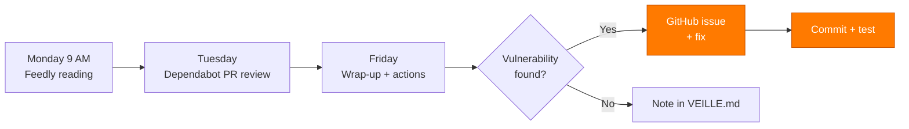

---
tags:
  - Security
  - Tech watch
  - ANSSI
  - OWASP
---

# Tech watch and security

!!! abstract "Why this page exists"
    The application developer role **changes every month**: new vulnerabilities,
    new frameworks, deprecations, breaking changes. An application that's secure
    today can be wide open tomorrow. This page documents **the watch system in
    place on Hook & Cook**: which sources, how often, and — most importantly —
    **the concrete fixes applied to the project** thanks to that watch.

## Monitored sources

Split into 4 categories. Sorted by **decreasing criticality**: security first,
then tech stack, then industry.

=== ":material-shield-alert: Security"

    | Source | Type | Frequency | Format |
    | --- | --- | --- | --- |
    | [CERT-FR](https://www.cert.ssi.gouv.fr/) | Official ANSSI advisories and alerts | Daily | RSS |
    | [ANSSI — Guides](https://cyber.gouv.fr/publications) | Best-practice guides | Monthly | PDF |
    | [OWASP Top 10](https://owasp.org/Top10/) | Most critical vulnerabilities | Every release | Web |
    | [OWASP Cheat Sheets](https://cheatsheetseries.owasp.org/) | Per-technology defense patterns | On demand | Web |
    | [NVD — NIST](https://nvd.nist.gov/vuln) | CVE catalogue | Daily | RSS |
    | [GitHub Security Advisories](https://github.com/advisories) | CVE on packages we use | Real-time | Dependabot |
    | [PortSwigger Research](https://portswigger.net/research) | Offensive web research | Weekly | RSS |

=== ":material-language-java: Backend (Grails/Groovy/Spring)"

    | Source | Type | Frequency |
    | --- | --- | --- |
    | [grails.org/news](https://grails.org/news.html) | Grails releases | Monthly |
    | [Spring Blog](https://spring.io/blog) | Spring Boot, CVEs, updates | Weekly |
    | [Groovy releases](https://groovy.apache.org/download.html) | Apache Groovy versions | Monthly |
    | [Hibernate ORM blog](https://in.relation.to/) | GORM/Hibernate breaking changes | Monthly |
    | [JWT.io blog](https://jwt.io/) | JWT/JWS standard evolutions | Quarterly |

=== ":material-react: Frontend (React/Vite)"

    | Source | Type | Frequency |
    | --- | --- | --- |
    | [react.dev/blog](https://react.dev/blog) | React releases | Monthly |
    | [vitejs.dev/blog](https://vitejs.dev/blog/) | Vite + Rolldown releases | Monthly |
    | [web.dev](https://web.dev/) | Performance, a11y, modern web | Weekly |
    | [MDN Web Docs — Updates](https://developer.mozilla.org/en-US/blog) | W3C / WHATWG standards | Weekly |
    | [Mozilla Hacks](https://hacks.mozilla.org/) | Browser evolutions and front-end security | Weekly |

=== ":material-database: Data + Payment"

    | Source | Type | Frequency |
    | --- | --- | --- |
    | [PostgreSQL News](https://www.postgresql.org/about/newsarchive/) | Postgres releases + CVEs | Monthly |
    | [Redis Blog](https://redis.io/blog/) | Releases + best practices | Monthly |
    | [Stripe API Changelog](https://docs.stripe.com/changelog) | API + SDK breaking changes | Monthly |
    | [stripe-java releases](https://github.com/stripe/stripe-java/releases) | New SDK versions | Monthly |
    | [Stripe Security Bulletins](https://stripe.com/docs/security) | Payment security advisories | On demand |

## Tools and automations

Manual watch alone isn't enough — you'd drown in sources. Three tools do 80 %
of the work:

<div class="grid cards" markdown>

-   :material-robot: &nbsp; **Dependabot**

    ---

    Enabled on the GitHub repo. Opens an **automatic PR** as soon as a
    backend (Gradle) or frontend (npm) dependency ships a version fixing
    a vulnerability. Configured for immediate alerts on
    `severity >= moderate`.

    *Covers: every npm + Maven package declared in the project.*

-   :material-shield-check: &nbsp; **npm audit + Gradle dependency check**

    ---

    Run before each local release:
    ```bash
    npm audit --audit-level=moderate    # frontend
    ./gradlew dependencyCheckAnalyze    # backend (to be wired)
    ```
    Produces a JSON report that can be plugged into CI later.

-   :material-rss: &nbsp; **Feedly + filters**

    ---

    RSS aggregator for the blogs (Spring, React, Vite, Postgres, Stripe).
    Read on Monday mornings (~20 min). Keyword filters:
    `security`, `CVE`, `breaking`, `deprecated`.

-   :material-bell-alert: &nbsp; **GitHub Watch + Releases**

    ---

    "Releases only" watch on critical repos:
    [grails/grails-core](https://github.com/grails/grails-core),
    [stripe/stripe-java](https://github.com/stripe/stripe-java),
    [facebook/react](https://github.com/facebook/react),
    [vitejs/vite](https://github.com/vitejs/vite).
    Email notification on each tag.

</div>

## Weekly routine



**Average time invested**: about 1 h per week, including 20 min of passive
reading and 40 min of action (PRs to review, fixes to apply, tests).

## Real-world applications

Three documented examples where the watch led to a direct code change.

### :material-target: Case #1 — Stripe webhook idempotency

!!! info "Trigger"
    Reading [Stripe Docs — Best practices for using webhooks](https://docs.stripe.com/webhooks#best-practices),
    *"Handle duplicate events"* section.

**Problem identified**
:   Stripe guarantees **at-least-once** event delivery. If our endpoint
    times out or returns a 5xx, Stripe **replays the same `event.id`**.
    Without deduplication, we process the order twice (duplicate email,
    potential double stock decrement depending on the sequence).

**Action taken**
:   Created `WebhookIdempotencyService` which stores each processed
    `event.id` in Redis with a 24 h TTL (`SETNX webhook:stripe:<id> EX 86400`).

**Impact**
:   Commit [`9992099`](https://github.com/S7venz/hook-cook/commit/9992099) —
    100 % of webhooks deduplicated, dedicated Spock tests
    ([`WebhookIdempotencyServiceSpec`](https://github.com/S7venz/hook-cook/blob/main/backend/src/test/groovy/backend/WebhookIdempotencyServiceSpec.groovy)).

---

### :material-target: Case #2 — Strict CSP for the frontend

!!! info "Trigger"
    OWASP — [Content Security Policy Cheat Sheet](https://cheatsheetseries.owasp.org/cheatsheets/Content_Security_Policy_Cheat_Sheet.html).

**Problem identified**
:   The default CSP allowed `unsafe-inline` for scripts, which neutralises
    XSS protections injected via the DOM.

**Action taken**
:   nginx configured with a restrictive CSP (`script-src 'self'`, nonces
    for indispensable inline scripts). Externalised the hero preload
    script that used to be inline.

**Impact**
:   Commits [`2cc5497`](https://github.com/S7venz/hook-cook/commit/2cc5497),
    [`5c8aa6c`](https://github.com/S7venz/hook-cook/commit/5c8aa6c) — every
    script served from our origin, no more `unsafe-inline` on
    `script-src`.

---

### :material-target: Case #3 — BCrypt 12 rounds migration

!!! info "Trigger"
    [OWASP Password Storage Cheat Sheet](https://cheatsheetseries.owasp.org/cheatsheets/Password_Storage_Cheat_Sheet.html)
    + 2024 ANSSI recommendations on password hashing.

**Problem identified**
:   Spring Security's default BCrypt cost (10) is below modern
    recommendations (12+ rounds for 2024+).

**Action taken**
:   Forced the cost to 12 in `AuthService` when hashing new passwords and
    resets.

**Impact**
:   Hashing about 4× more expensive for an attacker, latency
    imperceptible for the user (~250 ms).

## ⭐ Vulnerability found and fixed during watch

!!! danger "The most representative real-world case"
    The CDA evaluation criteria explicitly require the **description of a
    vulnerability potentially found and a flaw potentially fixed**. Here is
    the most complete case on Hook & Cook.

### Context

While reading section A07:2021 of the **OWASP Top 10** (*Identification and
Authentication Failures*), I re-read the code of my `RateLimitService`. The
comment at the top of the file admitted the limitation itself:

```groovy title="Before — RateLimitService.groovy"
/**
 * Simple, no external dependency. A real production setup should use
 * Bucket4j or an external store (Redis) shared across instances, but
 * for a monolithic single-instance backend like this one, this is enough.
 */
class RateLimitService {
    private final ConcurrentHashMap<String, Bucket> buckets = ...
}
```

### Diagnosis

!!! danger "Vulnerability"
    **Type**: rate-limit bypass via horizontal scaling.

    **Exploitation scenario**

    1. The backend is deployed as **2 instances** behind a load balancer (realistic in production)
    2. Each instance maintains **its own** in-memory `ConcurrentHashMap`
    3. An attacker alternates their login attempts between the two instances
    4. Their effective limit becomes **2× the advertised cap**

    At 10 instances, an attacker's quota is multiplied by 10 — invisible
    in logs because each instance sees "its" traffic as legitimate.

### Fix

Migrate the store to **Redis** (NoSQL key/value):

```groovy title="After — RateLimitService.groovy"
private boolean allowViaRedis(String key, int maxRequests, long windowMs) {
    String redisKey = REDIS_KEY_PREFIX + key
    Long count = stringRedisTemplate.opsForValue().increment(redisKey)
    if (count != null && count == 1L) {
        long windowSec = Math.max(1L, (long) Math.ceil(windowMs / 1000.0d))
        stringRedisTemplate.expire(redisKey, Duration.ofSeconds(windowSec))
    }
    return count != null && count <= maxRequests
}
```

Redis' native atomic `INCR` guarantees **no race condition across instances**.
The counter is **shared**, so the quota is **global**.

### Additional defensive coverage

- **In-memory fallback** if Redis goes down: we keep protecting locally
- **Dedicated Spock tests** verifying the nominal Redis path, overflow, Redis outage
- **Throttled log** when falling back (no log spam)

### Impact

| Before | After |
| --- | --- |
| Local per-instance quota | **Shared global** quota |
| Vulnerable to scaling | Robust up to N instances |
| No concurrency tests | 4 dedicated Spock tests |
| No fallback | In-memory fallback with throttled log |

[:material-source-commit: See commit 9992099 on GitHub](https://github.com/S7venz/hook-cook/commit/9992099){ .md-button .md-button--primary }

## Watching in English

!!! tip "CEFR B1 criterion"
    The CDA reference requires **B1 reading comprehension in English**. Since
    the majority of high-quality technical sources are in English, the watch
    serves as **natural proof** of that level.

Sources read regularly in English (extract from Feedly):

- *Spring Blog* — *"Spring Boot 3.x release announcements"*
- *Stripe Blog* — *"Webhook idempotency best practices"*
- *PortSwigger Research* — *"Web cache poisoning research"*
- *MDN Web Docs* — W3C/WHATWG articles (CSP, fetch, accessibility)
- *react.dev/blog* — *"React Compiler beta"*, *"React 19 Server Components"*
- *Mozilla Hacks* — *"Modern CSS for dynamic component-based architecture"*

Each major article is summarised in **2-3 lines** in a personal Notion
file, in English — additional practice in written expression.

## Complementary tooling, planned

To add during the project to further automate the watch:

- [ ] **SonarCloud** on CI for continuous code quality
- [ ] **OWASP ZAP baseline scan** in GitHub Actions (weekly passive scan)
- [ ] **Gradle OWASP dependency-check** plugin enabled (CVEs on Maven jars)
- [ ] **`renovate.json`** for finer control than Dependabot on PR cadence

---

<small>
*[Edit this page on GitHub](https://github.com/S7venz/hook-cook/edit/main/docs/VEILLE.md)*
</small>
