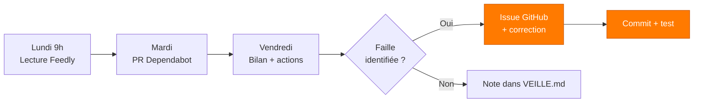

---
tags:
  - Sécurité
  - Veille
  - ANSSI
  - OWASP
---

# Veille technologique et sécurité

!!! abstract "Pourquoi cette page existe"
    Le métier de concepteur développeur d'applications **change tous les mois** :
    nouvelles vulnérabilités, nouveaux frameworks, dépréciations, breaking changes.
    Une application sécurisée aujourd'hui peut être trouée demain.
    Cette page documente **le système de veille en place sur Hook & Cook** :
    quelles sources, à quelle fréquence, et — surtout — **les corrections concrètes
    apportées au projet** grâce à cette veille.

## Sources surveillées

Réparties en 4 catégories. Le tri est fait par **criticité décroissante** :
sécurité d'abord, puis stack technique, puis industrie.

=== ":material-shield-alert: Sécurité"

    | Source | Type | Fréquence | Format |
    | --- | --- | --- | --- |
    | [CERT-FR](https://www.cert.ssi.gouv.fr/) | Avis et alertes officielles ANSSI | Quotidien | RSS |
    | [ANSSI — Guides](https://cyber.gouv.fr/publications) | Guides de bonnes pratiques | Mensuel | PDF |
    | [OWASP Top 10](https://owasp.org/Top10/) | Vulnérabilités les plus critiques | À chaque release | Web |
    | [OWASP Cheat Sheets](https://cheatsheetseries.owasp.org/) | Patterns de défense par techno | Au besoin | Web |
    | [NVD — NIST](https://nvd.nist.gov/vuln) | Catalogue CVE | Quotidien | RSS |
    | [GitHub Security Advisories](https://github.com/advisories) | CVE sur les packages utilisés | Temps réel | Dependabot |
    | [PortSwigger Research](https://portswigger.net/research) | Recherche offensive web | Hebdo | RSS |

=== ":material-language-java: Backend (Grails/Groovy/Spring)"

    | Source | Type | Fréquence |
    | --- | --- | --- |
    | [grails.org/news](https://grails.org/news.html) | Releases Grails | Mensuel |
    | [Spring Blog](https://spring.io/blog) | Spring Boot, CVE, updates | Hebdo |
    | [Groovy releases](https://groovy.apache.org/download.html) | Versions Apache Groovy | Mensuel |
    | [Hibernate ORM blog](https://in.relation.to/) | GORM/Hibernate breaking changes | Mensuel |
    | [JWT.io blog](https://jwt.io/) | Évolutions standards JWT/JWS | Trimestriel |

=== ":material-react: Frontend (React/Vite)"

    | Source | Type | Fréquence |
    | --- | --- | --- |
    | [react.dev/blog](https://react.dev/blog) | Releases React | Mensuel |
    | [vitejs.dev/blog](https://vitejs.dev/blog/) | Releases Vite + Rolldown | Mensuel |
    | [web.dev](https://web.dev/) | Performance, RGAA, modern web | Hebdo |
    | [MDN Web Docs — Updates](https://developer.mozilla.org/en-US/blog) | Standards W3C / WHATWG | Hebdo |
    | [Mozilla Hacks](https://hacks.mozilla.org/) | Évolutions navigateur + sécurité front | Hebdo |

=== ":material-database: Données + Paiement"

    | Source | Type | Fréquence |
    | --- | --- | --- |
    | [PostgreSQL News](https://www.postgresql.org/about/newsarchive/) | Releases + CVE Postgres | Mensuel |
    | [Redis Blog](https://redis.io/blog/) | Releases + bonnes pratiques | Mensuel |
    | [Stripe API Changelog](https://docs.stripe.com/changelog) | Breaking changes API + SDK | Mensuel |
    | [stripe-java releases](https://github.com/stripe/stripe-java/releases) | Nouvelle version SDK | Mensuel |
    | [Stripe Security Bulletins](https://stripe.com/docs/security) | Avis sécurité paiement | Au besoin |

## Outils et automatisations

La veille manuelle ne suffit pas — on est noyé sous les sources. Trois outils
font 80 % du travail à ma place :

<div class="grid cards" markdown>

-   :material-robot: &nbsp; **Dependabot**

    ---

    Activé sur le repo GitHub. Ouvre une **PR automatique** dès qu'une
    dépendance backend (Gradle) ou frontend (npm) sort une version corrigeant
    une vulnérabilité. Configuration : alertes immédiates pour
    `severity >= moderate`.

    *Couvre : tous les paquets npm + Maven déclarés dans le projet.*

-   :material-shield-check: &nbsp; **npm audit + Gradle dependency check**

    ---

    Lancés avant chaque release locale :
    ```bash
    npm audit --audit-level=moderate    # frontend
    ./gradlew dependencyCheckAnalyze    # backend (à brancher)
    ```
    Génère un rapport JSON exploitable en CI plus tard.

-   :material-rss: &nbsp; **Feedly + filtres**

    ---

    Agrégateur RSS pour les blogs (Spring, React, Vite, Postgres, Stripe).
    Lecture le lundi matin (~20 min). Filtre par mots-clés :
    `security`, `CVE`, `breaking`, `deprecated`.

-   :material-bell-alert: &nbsp; **GitHub Watch + Releases**

    ---

    Watch « Releases only » sur les repos critiques :
    [grails/grails-core](https://github.com/grails/grails-core),
    [stripe/stripe-java](https://github.com/stripe/stripe-java),
    [facebook/react](https://github.com/facebook/react),
    [vitejs/vite](https://github.com/vitejs/vite).
    Notifications par email à chaque tag.

</div>

## Rituel hebdomadaire



**Temps moyen consacré** : ~1h par semaine, dont 20 min de lecture passive et
40 min d'action (PR à reviewer, corrections à apporter, tests).

## Applications concrètes au projet

Trois exemples documentés où la veille a directement modifié le code.

### :material-target: Cas n°1 — Idempotence des webhooks Stripe

!!! info "Source du déclenchement"
    Lecture de [Stripe Docs — Best practices for using webhooks](https://docs.stripe.com/webhooks#best-practices),
    section *"Handle duplicate events"*.

**Problème identifié**
:   Stripe garantit une livraison **at-least-once** des events.
    Si notre endpoint renvoie un timeout ou un 5xx, Stripe **rejoue le même
    `event.id`**. Sans déduplication, on traite la commande 2 fois (double email,
    décrément stock potentiel).

**Action prise**
:   Création du `WebhookIdempotencyService` qui stocke chaque `event.id` traité
    dans Redis avec un TTL de 24h (`SETNX webhook:stripe:<id> EX 86400`).

**Impact**
:   Commit [`9992099`](https://github.com/S7venz/hook-cook/commit/9992099) —
    100 % des webhooks dédupliqués, tests Spock dédiés
    ([`WebhookIdempotencyServiceSpec`](https://github.com/S7venz/hook-cook/blob/main/backend/src/test/groovy/backend/WebhookIdempotencyServiceSpec.groovy)).

---

### :material-target: Cas n°2 — CSP stricte pour le frontend

!!! info "Source du déclenchement"
    OWASP — [Content Security Policy Cheat Sheet](https://cheatsheetseries.owasp.org/cheatsheets/Content_Security_Policy_Cheat_Sheet.html).

**Problème identifié**
:   La CSP par défaut autorisait `unsafe-inline` pour les scripts, ce qui
    annule les protections contre XSS injectées via le DOM.

**Action prise**
:   Configuration nginx avec une CSP restrictive (`script-src 'self'`,
    nonces pour les scripts inline indispensables). Externalisation du preload
    hero qui était inline.

**Impact**
:   Commits [`2cc5497`](https://github.com/S7venz/hook-cook/commit/2cc5497),
    [`5c8aa6c`](https://github.com/S7venz/hook-cook/commit/5c8aa6c) — tous les
    scripts servis par notre origine, plus aucun `unsafe-inline` sur les
    `script-src`.

---

### :material-target: Cas n°3 — Migration BCrypt 12 rounds

!!! info "Source du déclenchement"
    [OWASP Password Storage Cheat Sheet](https://cheatsheetseries.owasp.org/cheatsheets/Password_Storage_Cheat_Sheet.html)
    + recommandations ANSSI 2024 sur le hachage de mots de passe.

**Problème identifié**
:   Le coût BCrypt par défaut de Spring Security (10) est en-dessous des
    recommandations modernes (12+ rounds pour 2024+).

**Action prise**
:   Forçage du coût à 12 dans `AuthService` lors du hash des nouveaux mots
    de passe et resets.

**Impact**
:   Hashage ~4x plus coûteux pour un attaquant, latence imperceptible côté
    utilisateur (~250 ms).

## ⭐ Faille trouvée et corrigée pendant la veille

!!! danger "Le cas concret le plus représentatif"
    Le critère d'évaluation CDA demande explicitement la **description d'une
    vulnérabilité éventuellement trouvée et d'une faille potentiellement
    corrigée**. Voici le cas le plus complet sur Hook & Cook.

### Contexte

En lisant la section A07:2021 du **OWASP Top 10** (*Identification and
Authentication Failures*), j'ai relu le code de mon `RateLimitService`.
Le commentaire en tête de fichier admettait lui-même la limitation :

```groovy title="Avant — RateLimitService.groovy"
/**
 * Simple, sans dépendance externe. Une vraie prod devrait utiliser
 * Bucket4j ou un store externe (Redis) partagé entre instances, mais
 * pour un backend monolithique mono-instance comme ici, ça suffit.
 */
class RateLimitService {
    private final ConcurrentHashMap<String, Bucket> buckets = ...
}
```

### Diagnostic

!!! danger "Vulnérabilité"
    **Type** : contournement de rate-limit par scaling horizontal.

    **Scénario d'exploitation**

    1. Le backend est déployé en **2 instances** derrière un load balancer (réaliste pour la prod)
    2. Chaque instance maintient **son propre** `ConcurrentHashMap` en mémoire
    3. Un attaquant envoie ses tentatives de login en alternance entre les deux instances
    4. Sa limite réelle devient **2× le plafond annoncé**

    À 10 instances, un attaquant a un quota multiplié par 10 — invisible côté
    logs car chaque instance voit "son" trafic comme légitime.

### Correction

Migration du store vers **Redis** (NoSQL clé/valeur) :

```groovy title="Après — RateLimitService.groovy"
private boolean allowViaRedis(String key, int maxRequests, long windowMs) {
    String redisKey = REDIS_KEY_PREFIX + key
    Long count = stringRedisTemplate.opsForValue().increment(redisKey)
    if (count != null && count == 1L) {
        long windowSec = Math.max(1L, (long) Math.ceil(windowMs / 1000.0d))
        stringRedisTemplate.expire(redisKey, Duration.ofSeconds(windowSec))
    }
    return count != null && count <= maxRequests
}
```

L'atomicité native d'`INCR` Redis garantit qu'il n'y a **pas de race-condition
inter-instances**. Le compteur est **partagé**, donc le quota est **global**.

### Couverture défensive supplémentaire

- **Fallback in-memory** si Redis tombe : on continue à protéger localement
- **Tests Spock dédiés** vérifiant : chemin Redis nominal, dépassement, panne Redis
- **Log throttlé** quand on bascule en fallback (pas de log-spam)

### Impact

| Avant | Après |
| --- | --- |
| Quota local par instance | Quota **global partagé** |
| Vulnérable au scaling | Robuste jusqu'à N instances |
| Pas de tests sur la concurrence | 4 tests Spock dédiés |
| Pas de fallback | Fallback in-memory avec log throttlé |

[:material-source-commit: Voir le commit 9992099 sur GitHub](https://github.com/S7venz/hook-cook/commit/9992099){ .md-button .md-button--primary }

## Veille en anglais

!!! tip "Critère B1 du CECRL"
    Le référentiel exige le niveau **B1 en compréhension écrite anglaise**.
    La majorité des sources techniques de qualité étant en anglais, la veille
    constitue **la preuve naturelle de ce niveau**.

Sources lues régulièrement en anglais (extrait de Feedly) :

- *Spring Blog* — *"Spring Boot 3.x release announcements"*
- *Stripe Blog* — *"Webhook idempotency best practices"*
- *PortSwigger Research* — *"Web cache poisoning research"*
- *MDN Web Docs* — articles W3C/WHATWG (CSP, fetch, accessibility)
- *react.dev/blog* — *"React Compiler beta"*, *"React 19 Server Components"*
- *Mozilla Hacks* — *"Modern CSS for dynamic component-based architecture"*

Chaque article majeur lu est résumé en **2-3 lignes** dans un fichier Notion
personnel, en anglais — pratique additionnelle de l'expression écrite.

## Outils complémentaires en projet

À ajouter au fil du projet pour automatiser davantage la veille :

- [ ] **SonarCloud** sur la CI pour la qualité de code en continu
- [ ] **OWASP ZAP baseline scan** dans GitHub Actions (scan passif hebdo)
- [ ] **Gradle OWASP dependency-check** plugin activé (CVE sur Maven jars)
- [ ] **`renovate.json`** pour finer control que Dependabot sur le rythme des PR

---

<small>
*[Modifier cette page sur GitHub](https://github.com/S7venz/hook-cook/edit/main/docs/VEILLE.md)*
</small>
